<h1 align="center" style="border-bottom: none">
    Kubernetes Universal Orchestrator Extension
</h1>

<p align="center">
  <!-- Badges -->

<a href="https://github.com/Keyfactor/k8s-orchestrator/releases"></a>


</p>

<p align="center">
  <!-- TOC -->
  <a href="#support">
    <b>Support</b>
  </a>
  ·
  <a href="#installation">
    <b>Installation</b>
  </a>
  ·
  <a href="#license">
    <b>License</b>
  </a>
  ·
  <a href="https://github.com/orgs/Keyfactor/repositories?q=orchestrator">
    <b>Related Integrations</b>
  </a>
</p>

## Overview

The Kubernetes Orchestrator allows for the remote management of certificate stores defined in a Kubernetes cluster. 
The following types of Kubernetes resources are supported: kubernetes secrets of `kubernetes.io/tls` or `Opaque` and 
kubernetes certificates `certificates.k8s.io/v1`

The certificate store types that can be managed in the current version are:
- `K8SCert` - Kubernetes certificates of type `certificates.k8s.io/v1`
- `K8SSecret` - Kubernetes secrets of type `Opaque`
- `K8STLSSecret` - Kubernetes secrets of type `kubernetes.io/tls`
- `K8SCluster` - This allows for a single store to manage a k8s cluster's secrets or type `Opaque` and `kubernetes.io/tls`.
  This can be thought of as a container of `K8SSecret` and `K8STLSSecret` stores across all k8s namespaces.
- `K8SNS` - This allows for a single store to manage a k8s namespace's secrets or type `Opaque` and `kubernetes.io/tls`.
  This can be thought of as a container of `K8SSecret` and `K8STLSSecret` stores for a single k8s namespace.
- `K8SJKS` - Kubernetes secrets of type `Opaque` that contain one or more Java Keystore(s). These cannot be managed at the
  cluster or namespace level as they should all require unique credentials.
- `K8SPKCS12` - Kubernetes secrets of type `Opaque` that contain one or more PKCS12(s). These cannot be managed at the
  cluster or namespace level as they should all require unique credentials.

This orchestrator extension makes use of the Kubernetes API by using a service account
to communicate remotely with certificate stores. The service account must have the correct permissions
in order to perform the desired operations.  For more information on the required permissions, see the
[service account setup guide](#service-account-setup).

The Kubernetes Universal Orchestrator extension implements 7 Certificate Store Types. Depending on your use case, you may elect to use one, or all of these Certificate Store Types. Descriptions of each are provided below.

<details><summary>K8SCert (K8SCert)</summary>


### K8SCert

The `K8SCert` store type is used to manage Kubernetes certificates of type `certificates.k8s.io/v1`. 

**NOTE**: only `inventory` and `discovery` of these resources is supported with this extension. To provision these certs use the 
[k8s-csr-signer](https://github.com/Keyfactor/k8s-csr-signer).
</details>

<details><summary>K8SCluster (K8SCluster)</summary>


### K8SCluster

The `K8SCluster` store type allows for a single store to manage a k8s cluster's secrets or type `Opaque` and `kubernetes.io/tls`.
</details>

<details><summary>K8SJKS (K8SJKS)</summary>


### K8SJKS

The `K8SJKS` store type is used to manage Kubernetes secrets of type `Opaque`.  These secrets
must have a field that ends in `.jks`. The orchestrator will inventory and manage using a *custom alias* of the following
pattern: `<k8s_secret_field_name>/<keystore_alias>`.  For example, if the secret has a field named `mykeystore.jks` and
the keystore contains a certificate with an alias of `mycert`, the orchestrator will manage the certificate using the
alias `mykeystore.jks/mycert`. *NOTE* *This store type cannot be managed at the `cluster` or `namespace` level as they 
should all require unique credentials.*
</details>

<details><summary>K8SNS (K8SNS)</summary>


### K8SNS

The `K8SNS` store type is used to manage Kubernetes secrets of type `kubernetes.io/tls` and/or type `Opaque` in a single 
Keyfactor Command certificate store using an alias pattern of
</details>

<details><summary>K8SPKCS12 (K8SPKCS12)</summary>


### K8SPKCS12

The `K8SPKCS12` store type is used to manage Kubernetes secrets of type `Opaque`.  These secrets
must have a field that ends in `.pkcs12`. The orchestrator will inventory and manage using a *custom alias* of the following
pattern: `<k8s_secret_field_name>/<keystore_alias>`.  For example, if the secret has a field named `mykeystore.pkcs12` and
the keystore contains a certificate with an alias of `mycert`, the orchestrator will manage the certificate using the
alias `mykeystore.pkcs12/mycert`. *NOTE* *This store type cannot be managed at the `cluster` or `namespace` level as they
should all require unique credentials.*
</details>

<details><summary>K8SSecret (K8SSecret)</summary>


### K8SSecret

The `K8SSecret` store type is used to manage Kubernetes secrets of type `Opaque`.
</details>

<details><summary>K8STLSSecr (K8STLSSecr)</summary>


### K8STLSSecr

The `K8STLSSecret` store type is used to manage Kubernetes secrets of type `kubernetes.io/tls`
</details>


## Compatibility

This integration is compatible with Keyfactor Universal Orchestrator version 12.4 and later.

## Support
The Kubernetes Universal Orchestrator extension If you have a support issue, please open a support ticket by either contacting your Keyfactor representative or via the Keyfactor Support Portal at https://support.keyfactor.com. 
 
> To report a problem or suggest a new feature, use the **[Issues](../../issues)** tab. If you want to contribute actual bug fixes or proposed enhancements, use the **[Pull requests](../../pulls)** tab.

## Requirements & Prerequisites

Before installing the Kubernetes Universal Orchestrator extension, we recommend that you install [kfutil](https://github.com/Keyfactor/kfutil). Kfutil is a command-line tool that simplifies the process of creating store types, installing extensions, and instantiating certificate stores in Keyfactor Command.


### Kubernetes API Access
This orchestrator extension makes use of the Kubernetes API by using a service account
to communicate remotely with certificate stores. The service account must exist and have the appropriate permissions.
The service account token can be provided to the extension in one of two ways:
- As a raw JSON file that contains the service account credentials
- As a base64 encoded string that contains the service account credentials

#### Service Account Setup
To set up a service account user on your Kubernetes cluster to be used by the Kubernetes Orchestrator Extension. For full 
information on the required permissions, see the [service account setup guide](./scripts/kubernetes/README.md).


## Create Certificate Store Types

To use the Kubernetes Universal Orchestrator extension, you **must** create the Certificate Store Types required for your usecase. This only needs to happen _once_ per Keyfactor Command instance.

The Kubernetes Universal Orchestrator extension implements 7 Certificate Store Types. Depending on your use case, you may elect to use one, or all of these Certificate Store Types.

<details><summary>K8SCert (K8SCert)</summary>


* **Create K8SCert using kfutil**:

    ```shell
    # K8SCert
    kfutil store-types create K8SCert
    ```

* **Create K8SCert manually in the Command UI**:
    <details><summary>Create K8SCert manually in the Command UI</summary>

    Create a store type called `K8SCert` with the attributes in the tables below:

    #### Basic Tab
    | Attribute | Value | Description |
    | --------- | ----- | ----- |
    | Name | K8SCert | Display name for the store type (may be customized) |
    | Short Name | K8SCert | Short display name for the store type |
    | Capability | K8SCert | Store type name orchestrator will register with. Check the box to allow entry of value |
    | Supports Add | 🔲 Unchecked |  Indicates that the Store Type supports Management Add |
    | Supports Remove | 🔲 Unchecked |  Indicates that the Store Type supports Management Remove |
    | Supports Discovery | ✅ Checked | Check the box. Indicates that the Store Type supports Discovery |
    | Supports Reenrollment | 🔲 Unchecked |  Indicates that the Store Type supports Reenrollment |
    | Supports Create | 🔲 Unchecked |  Indicates that the Store Type supports store creation |
    | Needs Server | ✅ Checked | Determines if a target server name is required when creating store |
    | Blueprint Allowed | 🔲 Unchecked | Determines if store type may be included in an Orchestrator blueprint |
    | Uses PowerShell | 🔲 Unchecked | Determines if underlying implementation is PowerShell |
    | Requires Store Password | 🔲 Unchecked | Enables users to optionally specify a store password when defining a Certificate Store. |
    | Supports Entry Password | 🔲 Unchecked | Determines if an individual entry within a store can have a password. |

    The Basic tab should look like this:

    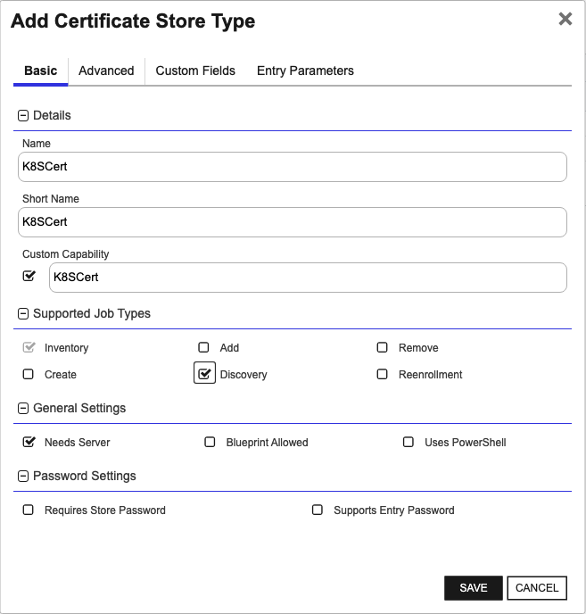

    #### Advanced Tab
    | Attribute | Value | Description |
    | --------- | ----- | ----- |
    | Supports Custom Alias | Forbidden | Determines if an individual entry within a store can have a custom Alias. |
    | Private Key Handling | Forbidden | This determines if Keyfactor can send the private key associated with a certificate to the store. Required because IIS certificates without private keys would be invalid. |
    | PFX Password Style | Default | 'Default' - PFX password is randomly generated, 'Custom' - PFX password may be specified when the enrollment job is created (Requires the Allow Custom Password application setting to be enabled.) |

    The Advanced tab should look like this:

    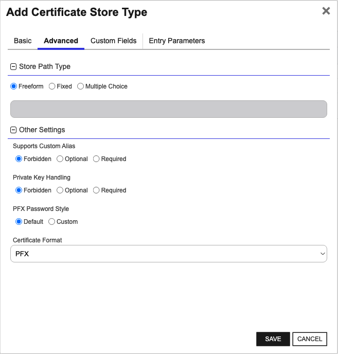

    #### Custom Fields Tab
    Custom fields operate at the certificate store level and are used to control how the orchestrator connects to the remote target server containing the certificate store to be managed. The following custom fields should be added to the store type:

    | Name | Display Name | Description | Type | Default Value/Options | Required |
    | ---- | ------------ | ---- | --------------------- | -------- | ----------- |
    | KubeNamespace | KubeNamespace |  | String | default | 🔲 Unchecked |
    | KubeSecretName | KubeSecretName |  | String |  | 🔲 Unchecked |
    | KubeSecretType | KubeSecretType |  | String | cert | ✅ Checked |

    The Custom Fields tab should look like this:

    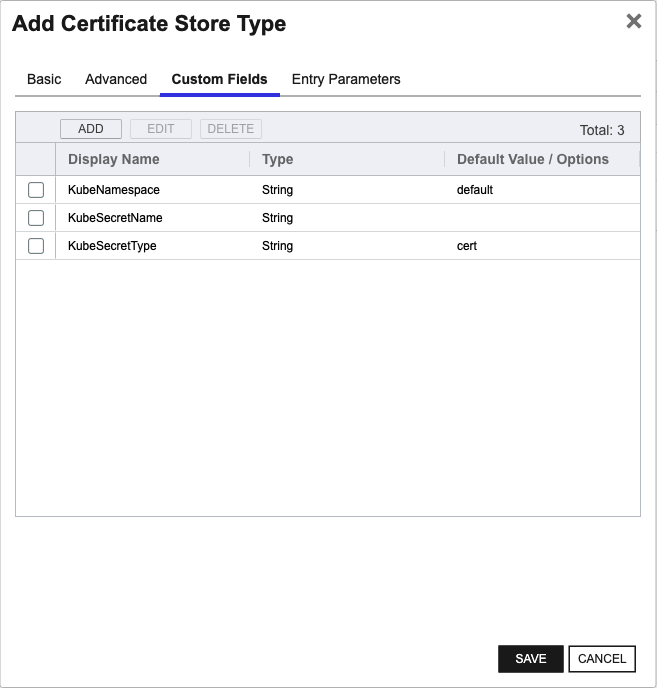


    </details>
</details>

<details><summary>K8SCluster (K8SCluster)</summary>


* **Create K8SCluster using kfutil**:

    ```shell
    # K8SCluster
    kfutil store-types create K8SCluster
    ```

* **Create K8SCluster manually in the Command UI**:
    <details><summary>Create K8SCluster manually in the Command UI</summary>

    Create a store type called `K8SCluster` with the attributes in the tables below:

    #### Basic Tab
    | Attribute | Value | Description |
    | --------- | ----- | ----- |
    | Name | K8SCluster | Display name for the store type (may be customized) |
    | Short Name | K8SCluster | Short display name for the store type |
    | Capability | K8SCluster | Store type name orchestrator will register with. Check the box to allow entry of value |
    | Supports Add | ✅ Checked | Check the box. Indicates that the Store Type supports Management Add |
    | Supports Remove | ✅ Checked | Check the box. Indicates that the Store Type supports Management Remove |
    | Supports Discovery | 🔲 Unchecked |  Indicates that the Store Type supports Discovery |
    | Supports Reenrollment | 🔲 Unchecked |  Indicates that the Store Type supports Reenrollment |
    | Supports Create | ✅ Checked | Check the box. Indicates that the Store Type supports store creation |
    | Needs Server | ✅ Checked | Determines if a target server name is required when creating store |
    | Blueprint Allowed | 🔲 Unchecked | Determines if store type may be included in an Orchestrator blueprint |
    | Uses PowerShell | 🔲 Unchecked | Determines if underlying implementation is PowerShell |
    | Requires Store Password | 🔲 Unchecked | Enables users to optionally specify a store password when defining a Certificate Store. |
    | Supports Entry Password | 🔲 Unchecked | Determines if an individual entry within a store can have a password. |

    The Basic tab should look like this:

    

    #### Advanced Tab
    | Attribute | Value | Description |
    | --------- | ----- | ----- |
    | Supports Custom Alias | Required | Determines if an individual entry within a store can have a custom Alias. |
    | Private Key Handling | Optional | This determines if Keyfactor can send the private key associated with a certificate to the store. Required because IIS certificates without private keys would be invalid. |
    | PFX Password Style | Default | 'Default' - PFX password is randomly generated, 'Custom' - PFX password may be specified when the enrollment job is created (Requires the Allow Custom Password application setting to be enabled.) |

    The Advanced tab should look like this:

    

    #### Custom Fields Tab
    Custom fields operate at the certificate store level and are used to control how the orchestrator connects to the remote target server containing the certificate store to be managed. The following custom fields should be added to the store type:

    | Name | Display Name | Description | Type | Default Value/Options | Required |
    | ---- | ------------ | ---- | --------------------- | -------- | ----------- |
    | SeparateChain | Separate Certificate Chain |  | Bool | false | 🔲 Unchecked |
    | IncludeCertChain | Include Certificate Chain |  | Bool | true | 🔲 Unchecked |

    The Custom Fields tab should look like this:

    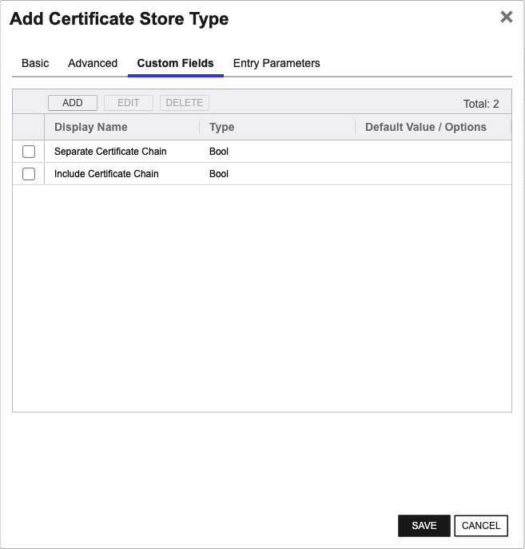


    </details>
</details>

<details><summary>K8SJKS (K8SJKS)</summary>


* **Create K8SJKS using kfutil**:

    ```shell
    # K8SJKS
    kfutil store-types create K8SJKS
    ```

* **Create K8SJKS manually in the Command UI**:
    <details><summary>Create K8SJKS manually in the Command UI</summary>

    Create a store type called `K8SJKS` with the attributes in the tables below:

    #### Basic Tab
    | Attribute | Value | Description |
    | --------- | ----- | ----- |
    | Name | K8SJKS | Display name for the store type (may be customized) |
    | Short Name | K8SJKS | Short display name for the store type |
    | Capability | K8SJKS | Store type name orchestrator will register with. Check the box to allow entry of value |
    | Supports Add | ✅ Checked | Check the box. Indicates that the Store Type supports Management Add |
    | Supports Remove | ✅ Checked | Check the box. Indicates that the Store Type supports Management Remove |
    | Supports Discovery | ✅ Checked | Check the box. Indicates that the Store Type supports Discovery |
    | Supports Reenrollment | 🔲 Unchecked |  Indicates that the Store Type supports Reenrollment |
    | Supports Create | ✅ Checked | Check the box. Indicates that the Store Type supports store creation |
    | Needs Server | ✅ Checked | Determines if a target server name is required when creating store |
    | Blueprint Allowed | 🔲 Unchecked | Determines if store type may be included in an Orchestrator blueprint |
    | Uses PowerShell | 🔲 Unchecked | Determines if underlying implementation is PowerShell |
    | Requires Store Password | 🔲 Unchecked | Enables users to optionally specify a store password when defining a Certificate Store. |
    | Supports Entry Password | 🔲 Unchecked | Determines if an individual entry within a store can have a password. |

    The Basic tab should look like this:

    

    #### Advanced Tab
    | Attribute | Value | Description |
    | --------- | ----- | ----- |
    | Supports Custom Alias | Required | Determines if an individual entry within a store can have a custom Alias. |
    | Private Key Handling | Optional | This determines if Keyfactor can send the private key associated with a certificate to the store. Required because IIS certificates without private keys would be invalid. |
    | PFX Password Style | Default | 'Default' - PFX password is randomly generated, 'Custom' - PFX password may be specified when the enrollment job is created (Requires the Allow Custom Password application setting to be enabled.) |

    The Advanced tab should look like this:

    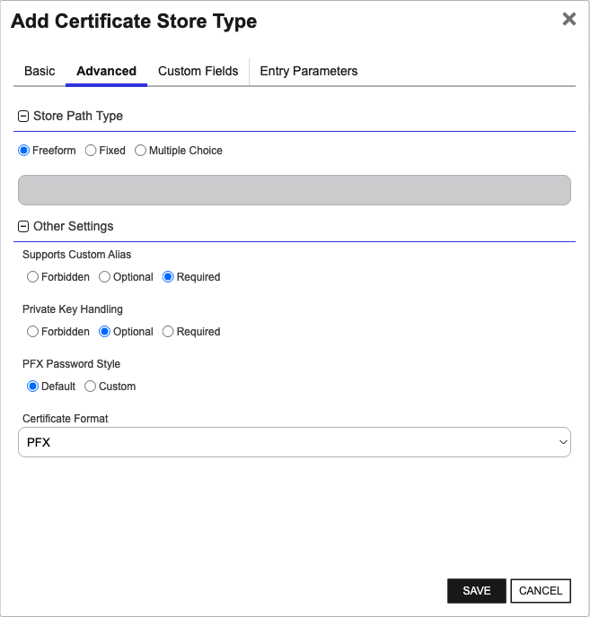

    #### Custom Fields Tab
    Custom fields operate at the certificate store level and are used to control how the orchestrator connects to the remote target server containing the certificate store to be managed. The following custom fields should be added to the store type:

    | Name | Display Name | Description | Type | Default Value/Options | Required |
    | ---- | ------------ | ---- | --------------------- | -------- | ----------- |
    | KubeNamespace | KubeNamespace |  | String | default | 🔲 Unchecked |
    | KubeSecretName | KubeSecretName |  | String |  | 🔲 Unchecked |
    | KubeSecretType | KubeSecretType |  | String | jks | ✅ Checked |
    | CertificateDataFieldName | CertificateDataFieldName |  | String | .jks | ✅ Checked |
    | PasswordFieldName | PasswordFieldName |  | String | password | 🔲 Unchecked |
    | PasswordIsK8SSecret | Password Is K8S Secret |  | Bool | false | 🔲 Unchecked |
    | StorePasswordPath | StorePasswordPath |  | String |  | 🔲 Unchecked |

    The Custom Fields tab should look like this:

    


    </details>
</details>

<details><summary>K8SNS (K8SNS)</summary>


* **Create K8SNS using kfutil**:

    ```shell
    # K8SNS
    kfutil store-types create K8SNS
    ```

* **Create K8SNS manually in the Command UI**:
    <details><summary>Create K8SNS manually in the Command UI</summary>

    Create a store type called `K8SNS` with the attributes in the tables below:

    #### Basic Tab
    | Attribute | Value | Description |
    | --------- | ----- | ----- |
    | Name | K8SNS | Display name for the store type (may be customized) |
    | Short Name | K8SNS | Short display name for the store type |
    | Capability | K8SNS | Store type name orchestrator will register with. Check the box to allow entry of value |
    | Supports Add | ✅ Checked | Check the box. Indicates that the Store Type supports Management Add |
    | Supports Remove | ✅ Checked | Check the box. Indicates that the Store Type supports Management Remove |
    | Supports Discovery | ✅ Checked | Check the box. Indicates that the Store Type supports Discovery |
    | Supports Reenrollment | 🔲 Unchecked |  Indicates that the Store Type supports Reenrollment |
    | Supports Create | ✅ Checked | Check the box. Indicates that the Store Type supports store creation |
    | Needs Server | ✅ Checked | Determines if a target server name is required when creating store |
    | Blueprint Allowed | 🔲 Unchecked | Determines if store type may be included in an Orchestrator blueprint |
    | Uses PowerShell | 🔲 Unchecked | Determines if underlying implementation is PowerShell |
    | Requires Store Password | 🔲 Unchecked | Enables users to optionally specify a store password when defining a Certificate Store. |
    | Supports Entry Password | 🔲 Unchecked | Determines if an individual entry within a store can have a password. |

    The Basic tab should look like this:

    

    #### Advanced Tab
    | Attribute | Value | Description |
    | --------- | ----- | ----- |
    | Supports Custom Alias | Required | Determines if an individual entry within a store can have a custom Alias. |
    | Private Key Handling | Optional | This determines if Keyfactor can send the private key associated with a certificate to the store. Required because IIS certificates without private keys would be invalid. |
    | PFX Password Style | Default | 'Default' - PFX password is randomly generated, 'Custom' - PFX password may be specified when the enrollment job is created (Requires the Allow Custom Password application setting to be enabled.) |

    The Advanced tab should look like this:

    

    #### Custom Fields Tab
    Custom fields operate at the certificate store level and are used to control how the orchestrator connects to the remote target server containing the certificate store to be managed. The following custom fields should be added to the store type:

    | Name | Display Name | Description | Type | Default Value/Options | Required |
    | ---- | ------------ | ---- | --------------------- | -------- | ----------- |
    | KubeNamespace | Kube Namespace |  | String | default | 🔲 Unchecked |
    | SeparateChain | Separate Certificate Chain |  | Bool | false | 🔲 Unchecked |
    | IncludeCertChain | Include Certificate Chain |  | Bool | true | 🔲 Unchecked |

    The Custom Fields tab should look like this:

    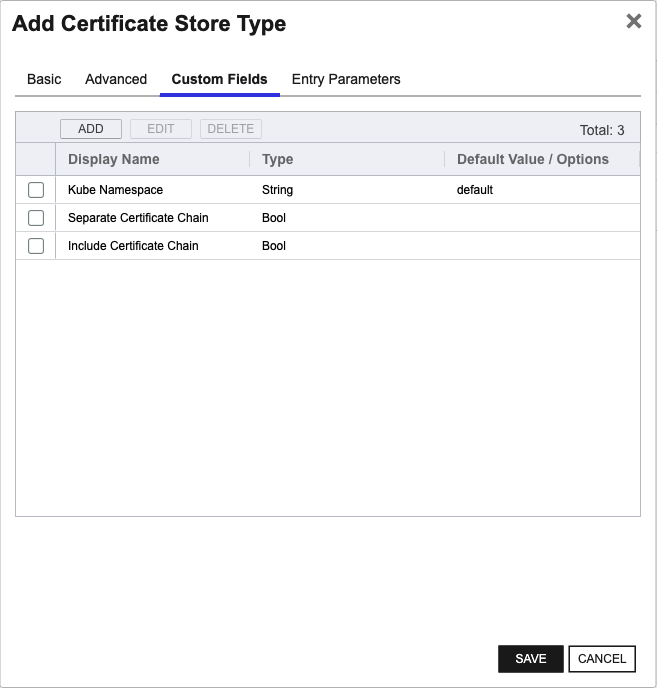


    </details>
</details>

<details><summary>K8SPKCS12 (K8SPKCS12)</summary>


* **Create K8SPKCS12 using kfutil**:

    ```shell
    # K8SPKCS12
    kfutil store-types create K8SPKCS12
    ```

* **Create K8SPKCS12 manually in the Command UI**:
    <details><summary>Create K8SPKCS12 manually in the Command UI</summary>

    Create a store type called `K8SPKCS12` with the attributes in the tables below:

    #### Basic Tab
    | Attribute | Value | Description |
    | --------- | ----- | ----- |
    | Name | K8SPKCS12 | Display name for the store type (may be customized) |
    | Short Name | K8SPKCS12 | Short display name for the store type |
    | Capability | K8SPKCS12 | Store type name orchestrator will register with. Check the box to allow entry of value |
    | Supports Add | ✅ Checked | Check the box. Indicates that the Store Type supports Management Add |
    | Supports Remove | ✅ Checked | Check the box. Indicates that the Store Type supports Management Remove |
    | Supports Discovery | ✅ Checked | Check the box. Indicates that the Store Type supports Discovery |
    | Supports Reenrollment | 🔲 Unchecked |  Indicates that the Store Type supports Reenrollment |
    | Supports Create | ✅ Checked | Check the box. Indicates that the Store Type supports store creation |
    | Needs Server | ✅ Checked | Determines if a target server name is required when creating store |
    | Blueprint Allowed | 🔲 Unchecked | Determines if store type may be included in an Orchestrator blueprint |
    | Uses PowerShell | 🔲 Unchecked | Determines if underlying implementation is PowerShell |
    | Requires Store Password | 🔲 Unchecked | Enables users to optionally specify a store password when defining a Certificate Store. |
    | Supports Entry Password | 🔲 Unchecked | Determines if an individual entry within a store can have a password. |

    The Basic tab should look like this:

    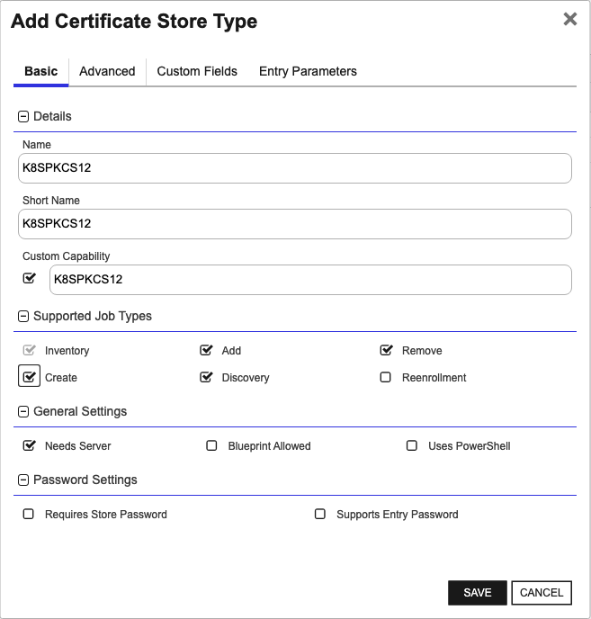

    #### Advanced Tab
    | Attribute | Value | Description |
    | --------- | ----- | ----- |
    | Supports Custom Alias | Required | Determines if an individual entry within a store can have a custom Alias. |
    | Private Key Handling | Optional | This determines if Keyfactor can send the private key associated with a certificate to the store. Required because IIS certificates without private keys would be invalid. |
    | PFX Password Style | Default | 'Default' - PFX password is randomly generated, 'Custom' - PFX password may be specified when the enrollment job is created (Requires the Allow Custom Password application setting to be enabled.) |

    The Advanced tab should look like this:

    

    #### Custom Fields Tab
    Custom fields operate at the certificate store level and are used to control how the orchestrator connects to the remote target server containing the certificate store to be managed. The following custom fields should be added to the store type:

    | Name | Display Name | Description | Type | Default Value/Options | Required |
    | ---- | ------------ | ---- | --------------------- | -------- | ----------- |
    | KubeSecretType | Kube Secret Type |  | String | pkcs12 | ✅ Checked |
    | CertificateDataFieldName | CertificateDataFieldName |  | String | .p12 | ✅ Checked |
    | PasswordFieldName | Password Field Name |  | String | password | 🔲 Unchecked |
    | PasswordIsK8SSecret | Password Is K8S Secret |  | Bool | false | 🔲 Unchecked |
    | KubeNamespace | Kube Namespace |  | String | default | 🔲 Unchecked |
    | KubeSecretName | Kube Secret Name |  | String |  | 🔲 Unchecked |
    | StorePasswordPath | StorePasswordPath |  | String |  | 🔲 Unchecked |

    The Custom Fields tab should look like this:

    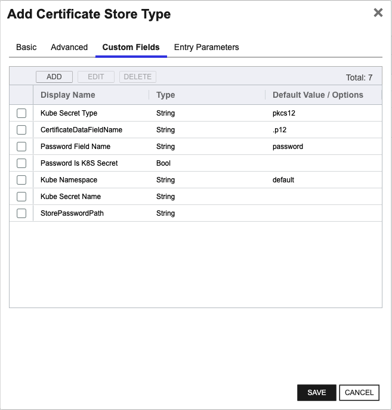


    </details>
</details>

<details><summary>K8SSecret (K8SSecret)</summary>


* **Create K8SSecret using kfutil**:

    ```shell
    # K8SSecret
    kfutil store-types create K8SSecret
    ```

* **Create K8SSecret manually in the Command UI**:
    <details><summary>Create K8SSecret manually in the Command UI</summary>

    Create a store type called `K8SSecret` with the attributes in the tables below:

    #### Basic Tab
    | Attribute | Value | Description |
    | --------- | ----- | ----- |
    | Name | K8SSecret | Display name for the store type (may be customized) |
    | Short Name | K8SSecret | Short display name for the store type |
    | Capability | K8SSecret | Store type name orchestrator will register with. Check the box to allow entry of value |
    | Supports Add | ✅ Checked | Check the box. Indicates that the Store Type supports Management Add |
    | Supports Remove | ✅ Checked | Check the box. Indicates that the Store Type supports Management Remove |
    | Supports Discovery | ✅ Checked | Check the box. Indicates that the Store Type supports Discovery |
    | Supports Reenrollment | 🔲 Unchecked |  Indicates that the Store Type supports Reenrollment |
    | Supports Create | ✅ Checked | Check the box. Indicates that the Store Type supports store creation |
    | Needs Server | ✅ Checked | Determines if a target server name is required when creating store |
    | Blueprint Allowed | 🔲 Unchecked | Determines if store type may be included in an Orchestrator blueprint |
    | Uses PowerShell | 🔲 Unchecked | Determines if underlying implementation is PowerShell |
    | Requires Store Password | 🔲 Unchecked | Enables users to optionally specify a store password when defining a Certificate Store. |
    | Supports Entry Password | 🔲 Unchecked | Determines if an individual entry within a store can have a password. |

    The Basic tab should look like this:

    

    #### Advanced Tab
    | Attribute | Value | Description |
    | --------- | ----- | ----- |
    | Supports Custom Alias | Forbidden | Determines if an individual entry within a store can have a custom Alias. |
    | Private Key Handling | Optional | This determines if Keyfactor can send the private key associated with a certificate to the store. Required because IIS certificates without private keys would be invalid. |
    | PFX Password Style | Default | 'Default' - PFX password is randomly generated, 'Custom' - PFX password may be specified when the enrollment job is created (Requires the Allow Custom Password application setting to be enabled.) |

    The Advanced tab should look like this:

    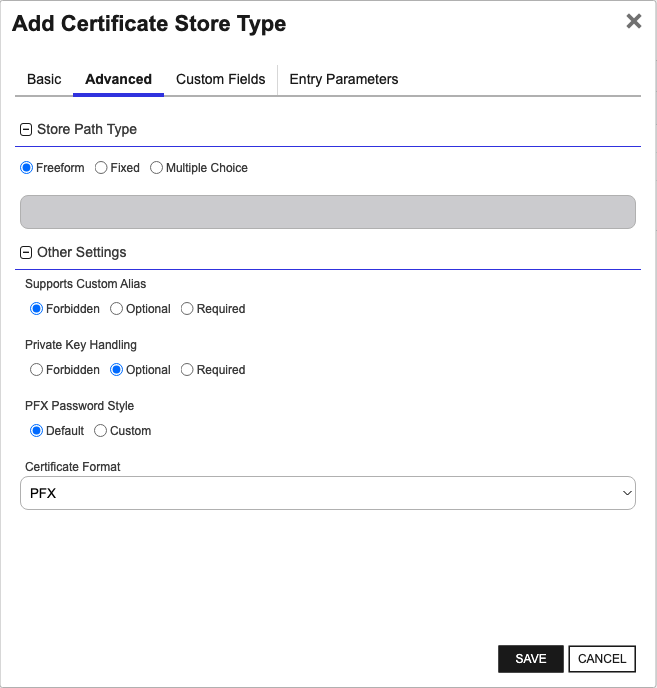

    #### Custom Fields Tab
    Custom fields operate at the certificate store level and are used to control how the orchestrator connects to the remote target server containing the certificate store to be managed. The following custom fields should be added to the store type:

    | Name | Display Name | Description | Type | Default Value/Options | Required |
    | ---- | ------------ | ---- | --------------------- | -------- | ----------- |
    | KubeNamespace | KubeNamespace |  | String |  | 🔲 Unchecked |
    | KubeSecretName | KubeSecretName |  | String |  | 🔲 Unchecked |
    | KubeSecretType | KubeSecretType |  | String | secret | ✅ Checked |
    | SeparateChain | Separate Certificate Chain |  | Bool | false | 🔲 Unchecked |
    | IncludeCertChain | Include Certificate Chain |  | Bool | true | 🔲 Unchecked |

    The Custom Fields tab should look like this:

    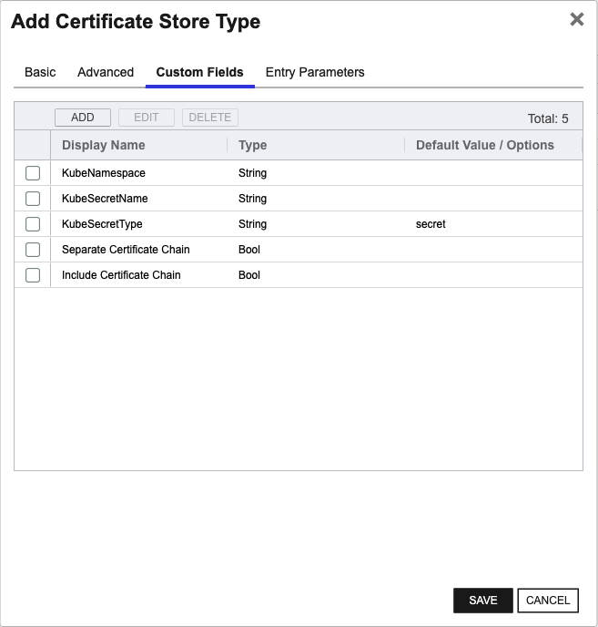


    </details>
</details>

<details><summary>K8STLSSecr (K8STLSSecr)</summary>


* **Create K8STLSSecr using kfutil**:

    ```shell
    # K8STLSSecr
    kfutil store-types create K8STLSSecr
    ```

* **Create K8STLSSecr manually in the Command UI**:
    <details><summary>Create K8STLSSecr manually in the Command UI</summary>

    Create a store type called `K8STLSSecr` with the attributes in the tables below:

    #### Basic Tab
    | Attribute | Value | Description |
    | --------- | ----- | ----- |
    | Name | K8STLSSecr | Display name for the store type (may be customized) |
    | Short Name | K8STLSSecr | Short display name for the store type |
    | Capability | K8STLSSecr | Store type name orchestrator will register with. Check the box to allow entry of value |
    | Supports Add | ✅ Checked | Check the box. Indicates that the Store Type supports Management Add |
    | Supports Remove | ✅ Checked | Check the box. Indicates that the Store Type supports Management Remove |
    | Supports Discovery | ✅ Checked | Check the box. Indicates that the Store Type supports Discovery |
    | Supports Reenrollment | 🔲 Unchecked |  Indicates that the Store Type supports Reenrollment |
    | Supports Create | ✅ Checked | Check the box. Indicates that the Store Type supports store creation |
    | Needs Server | ✅ Checked | Determines if a target server name is required when creating store |
    | Blueprint Allowed | 🔲 Unchecked | Determines if store type may be included in an Orchestrator blueprint |
    | Uses PowerShell | 🔲 Unchecked | Determines if underlying implementation is PowerShell |
    | Requires Store Password | 🔲 Unchecked | Enables users to optionally specify a store password when defining a Certificate Store. |
    | Supports Entry Password | 🔲 Unchecked | Determines if an individual entry within a store can have a password. |

    The Basic tab should look like this:

    

    #### Advanced Tab
    | Attribute | Value | Description |
    | --------- | ----- | ----- |
    | Supports Custom Alias | Forbidden | Determines if an individual entry within a store can have a custom Alias. |
    | Private Key Handling | Optional | This determines if Keyfactor can send the private key associated with a certificate to the store. Required because IIS certificates without private keys would be invalid. |
    | PFX Password Style | Default | 'Default' - PFX password is randomly generated, 'Custom' - PFX password may be specified when the enrollment job is created (Requires the Allow Custom Password application setting to be enabled.) |

    The Advanced tab should look like this:

    

    #### Custom Fields Tab
    Custom fields operate at the certificate store level and are used to control how the orchestrator connects to the remote target server containing the certificate store to be managed. The following custom fields should be added to the store type:

    | Name | Display Name | Description | Type | Default Value/Options | Required |
    | ---- | ------------ | ---- | --------------------- | -------- | ----------- |
    | KubeNamespace | KubeNamespace |  | String |  | 🔲 Unchecked |
    | KubeSecretName | KubeSecretName |  | String |  | 🔲 Unchecked |
    | KubeSecretType | KubeSecretType |  | String | tls_secret | ✅ Checked |
    | SeparateChain | Separate Certificate Chain |  | Bool | false | 🔲 Unchecked |
    | IncludeCertChain | Include Certificate Chain |  | Bool | true | 🔲 Unchecked |

    The Custom Fields tab should look like this:

    


    </details>
</details>


## Installation

1. **Download the latest Kubernetes Universal Orchestrator extension from GitHub.** 

    Navigate to the [Kubernetes Universal Orchestrator extension GitHub version page](https://github.com/Keyfactor/k8s-orchestrator/releases/latest). Refer to the compatibility matrix below to determine whether the `net6.0` or `net8.0` asset should be downloaded. Then, click the corresponding asset to download the zip archive.
    | Universal Orchestrator Version | Latest .NET version installed on the Universal Orchestrator server | `rollForward` condition in `Orchestrator.runtimeconfig.json` | `k8s-orchestrator` .NET version to download |
    | --------- | ----------- | ----------- | ----------- |
    | Older than `11.0.0` | | | `net6.0` |
    | Between `11.0.0` and `11.5.1` (inclusive) | `net6.0` | | `net6.0` | 
    | Between `11.0.0` and `11.5.1` (inclusive) | `net8.0` | `Disable` | `net6.0` | 
    | Between `11.0.0` and `11.5.1` (inclusive) | `net8.0` | `LatestMajor` | `net8.0` | 
    | `11.6` _and_ newer | `net8.0` | | `net8.0` |

    Unzip the archive containing extension assemblies to a known location.

    > **Note** If you don't see an asset with a corresponding .NET version, you should always assume that it was compiled for `net6.0`.

2. **Locate the Universal Orchestrator extensions directory.**

    * **Default on Windows** - `C:\Program Files\Keyfactor\Keyfactor Orchestrator\extensions`
    * **Default on Linux** - `/opt/keyfactor/orchestrator/extensions`
    
3. **Create a new directory for the Kubernetes Universal Orchestrator extension inside the extensions directory.**
        
    Create a new directory called `k8s-orchestrator`.
    > The directory name does not need to match any names used elsewhere; it just has to be unique within the extensions directory.

4. **Copy the contents of the downloaded and unzipped assemblies from __step 2__ to the `k8s-orchestrator` directory.**

5. **Restart the Universal Orchestrator service.**

    Refer to [Starting/Restarting the Universal Orchestrator service](https://software.keyfactor.com/Core-OnPrem/Current/Content/InstallingAgents/NetCoreOrchestrator/StarttheService.htm).


6. **(optional) PAM Integration** 

    The Kubernetes Universal Orchestrator extension is compatible with all supported Keyfactor PAM extensions to resolve PAM-eligible secrets. PAM extensions running on Universal Orchestrators enable secure retrieval of secrets from a connected PAM provider.

    To configure a PAM provider, [reference the Keyfactor Integration Catalog](https://keyfactor.github.io/integrations-catalog/content/pam) to select an extension, and follow the associated instructions to install it on the Universal Orchestrator (remote).


> The above installation steps can be supplemented by the [official Command documentation](https://software.keyfactor.com/Core-OnPrem/Current/Content/InstallingAgents/NetCoreOrchestrator/CustomExtensions.htm?Highlight=extensions).


## Defining Certificate Stores

The Kubernetes Universal Orchestrator extension implements 7 Certificate Store Types, each of which implements different functionality. Refer to the individual instructions below for each Certificate Store Type that you deemed necessary for your use case from the installation section.

<details><summary>K8SCert (K8SCert)</summary>


* **Manually with the Command UI**

    <details><summary>Create Certificate Stores manually in the UI</summary>

    1. **Navigate to the _Certificate Stores_ page in Keyfactor Command.**

        Log into Keyfactor Command, toggle the _Locations_ dropdown, and click _Certificate Stores_.

    2. **Add a Certificate Store.**

        Click the Add button to add a new Certificate Store. Use the table below to populate the **Attributes** in the **Add** form.
        | Attribute | Description |
        | --------- | ----------- |
        | Category | Select "K8SCert" or the customized certificate store name from the previous step. |
        | Container | Optional container to associate certificate store with. |
        | Client Machine |  |
        | Store Path |  |
        | Orchestrator | Select an approved orchestrator capable of managing `K8SCert` certificates. Specifically, one with the `K8SCert` capability. |
        | KubeNamespace |  |
        | KubeSecretName |  |
        | KubeSecretType |  |


        

        <details><summary>Attributes eligible for retrieval by a PAM Provider on the Universal Orchestrator</summary>

        If a PAM provider was installed _on the Universal Orchestrator_ in the [Installation](#Installation) section, the following parameters can be configured for retrieval _on the Universal Orchestrator_.
        | Attribute | Description |
        | --------- | ----------- |


        Please refer to the **Universal Orchestrator (remote)** usage section ([PAM providers on the Keyfactor Integration Catalog](https://keyfactor.github.io/integrations-catalog/content/pam)) for your selected PAM provider for instructions on how to load attributes orchestrator-side.

        > Any secret can be rendered by a PAM provider _installed on the Keyfactor Command server_. The above parameters are specific to attributes that can be fetched by an installed PAM provider running on the Universal Orchestrator server itself. 
        </details>
        

    </details>

* **Using kfutil**
    
    <details><summary>Create Certificate Stores with kfutil</summary>
    
    1. **Generate a CSV template for the K8SCert certificate store**

        ```shell
        kfutil stores import generate-template --store-type-name K8SCert --outpath K8SCert.csv
        ```
    2. **Populate the generated CSV file**

        Open the CSV file, and reference the table below to populate parameters for each **Attribute**.
        | Attribute | Description |
        | --------- | ----------- |
        | Category | Select "K8SCert" or the customized certificate store name from the previous step. |
        | Container | Optional container to associate certificate store with. |
        | Client Machine |  |
        | Store Path |  |
        | Orchestrator | Select an approved orchestrator capable of managing `K8SCert` certificates. Specifically, one with the `K8SCert` capability. |
        | KubeNamespace |  |
        | KubeSecretName |  |
        | KubeSecretType |  |


        

        <details><summary>Attributes eligible for retrieval by a PAM Provider on the Universal Orchestrator</summary>

        If a PAM provider was installed _on the Universal Orchestrator_ in the [Installation](#Installation) section, the following parameters can be configured for retrieval _on the Universal Orchestrator_.
        | Attribute | Description |
        | --------- | ----------- |


        > Any secret can be rendered by a PAM provider _installed on the Keyfactor Command server_. The above parameters are specific to attributes that can be fetched by an installed PAM provider running on the Universal Orchestrator server itself. 
        </details>
        

    3. **Import the CSV file to create the certificate stores** 

        ```shell
        kfutil stores import csv --store-type-name K8SCert --file K8SCert.csv
        ```
    </details>

> The content in this section can be supplemented by the [official Command documentation](https://software.keyfactor.com/Core-OnPrem/Current/Content/ReferenceGuide/Certificate%20Stores.htm?Highlight=certificate%20store).


</details>

<details><summary>K8SCluster (K8SCluster)</summary>

In order for certificates of type `Opaque` and/or `kubernetes.io/tls` to be inventoried in `K8SCluster` store types, they must
have specific keys in the Kubernetes secret.
- Required keys: `tls.crt` or `ca.crt`
- Additional keys: `tls.key`

### Storepath Patterns
- `<cluster_name>`

### Alias Patterns
- `<namespace_name>/secrets/<tls|opaque>/<secret_name>`


> The content in this section can be supplemented by the [official Command documentation](https://software.keyfactor.com/Core-OnPrem/Current/Content/ReferenceGuide/Certificate%20Stores.htm?Highlight=certificate%20store).


</details>

<details><summary>K8SJKS (K8SJKS)</summary>

In order for certificates of type `Opaque` to be inventoried as `K8SJKS` store types, they must have specific keys in
the Kubernetes secret.
- Valid Keys: `*.jks`

### Storepath Patterns
- `<namespace_name>/<secret_name>`
- `<namespace_name>/secrets/<secret_name>`
- `<cluster_name>/<namespace_name>/secrets/<secret_name>`

### Alias Patterns
- `<k8s_secret_field_name>/<keystore_alias>`

Example: `test.jks/load_balancer` where `test.jks` is the field name on the `Opaque` secret and `load_balancer` is
the certificate alias in the `jks` data store.


> The content in this section can be supplemented by the [official Command documentation](https://software.keyfactor.com/Core-OnPrem/Current/Content/ReferenceGuide/Certificate%20Stores.htm?Highlight=certificate%20store).


</details>

<details><summary>K8SNS (K8SNS)</summary>

In order for certificates of type `Opaque` and/or `kubernetes.io/tls` to be inventoried in `K8SNS` store types, they must 
have specific keys in the Kubernetes secret.
- Required keys: `tls.crt` or `ca.crt`
- Additional keys: `tls.key`

### Storepath Patterns
- `<namespace_name>`
- `<cluster_name>/<namespace_name>`

### Alias Patterns
- `secrets/<tls|opaque>/<secret_name>`


> The content in this section can be supplemented by the [official Command documentation](https://software.keyfactor.com/Core-OnPrem/Current/Content/ReferenceGuide/Certificate%20Stores.htm?Highlight=certificate%20store).


</details>

<details><summary>K8SPKCS12 (K8SPKCS12)</summary>

In order for certificates of type `Opaque` to be inventoried as `K8SPKCS12` store types, they must have specific keys in
the Kubernetes secret.
- Valid Keys: `*.pfx`, `*.pkcs12`, `*.p12`

### Storepath Patterns
- `<namespace_name>/<secret_name>`
- `<namespace_name>/secrets/<secret_name>`
- `<cluster_name>/<namespace_name>/secrets/<secret_name>`

### Alias Patterns
- `<k8s_secret_field_name>/<keystore_alias>`

Example: `test.pkcs12/load_balancer` where `test.pkcs12` is the field name on the `Opaque` secret and `load_balancer` is
the certificate alias in the `pkcs12` data store.


> The content in this section can be supplemented by the [official Command documentation](https://software.keyfactor.com/Core-OnPrem/Current/Content/ReferenceGuide/Certificate%20Stores.htm?Highlight=certificate%20store).


</details>

<details><summary>K8SSecret (K8SSecret)</summary>

In order for certificates of type `Opaque` to be inventoried as `K8SSecret` store types, they must have specific keys in 
the Kubernetes secret.  
- Required keys: `tls.crt` or `ca.crt` 
- Additional keys: `tls.key`


> The content in this section can be supplemented by the [official Command documentation](https://software.keyfactor.com/Core-OnPrem/Current/Content/ReferenceGuide/Certificate%20Stores.htm?Highlight=certificate%20store).


</details>

<details><summary>K8STLSSecr (K8STLSSecr)</summary>

In order for certificates of type `kubernetes.io/tls` to be inventoried, they must have specific keys in
the Kubernetes secret.
- Required keys: `tls.crt` and `tls.key`
- Optional keys: `ca.crt`


> The content in this section can be supplemented by the [official Command documentation](https://software.keyfactor.com/Core-OnPrem/Current/Content/ReferenceGuide/Certificate%20Stores.htm?Highlight=certificate%20store).


</details>

## Discovering Certificate Stores with the Discovery Job
**NOTE:** To use discovery jobs, you must have the story type created in Keyfactor Command and the `needs_server` 
checkbox *MUST* be checked, if you do not select `needs_server` you will not be able to provide credentials to the 
discovery job and it will fail.

The Kubernetes Orchestrator Extension supports certificate discovery jobs.  This allows you to populate the certificate stores with existing certificates.  To run a discovery job, follow these steps:
1. Click on the "Locations > Certificate Stores" menu item.
2. Click the "Discover" tab.
3. Click the "Schedule" button.
4. Configure the job based on storetype. **Note** the "Server Username" field must be set to `kubeconfig` and the "Server Password" field is the `kubeconfig` formatted JSON file containing the service account credentials.  See the "Service Account Setup" section earlier in this README for more information on setting up a service account.
   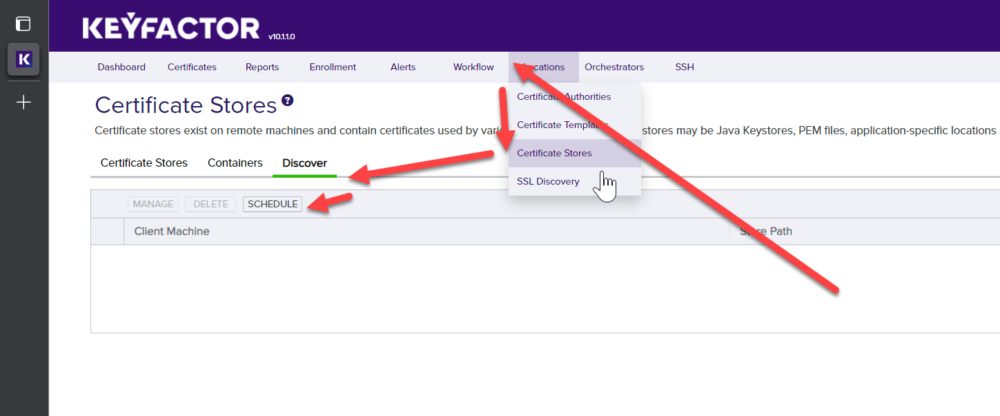
   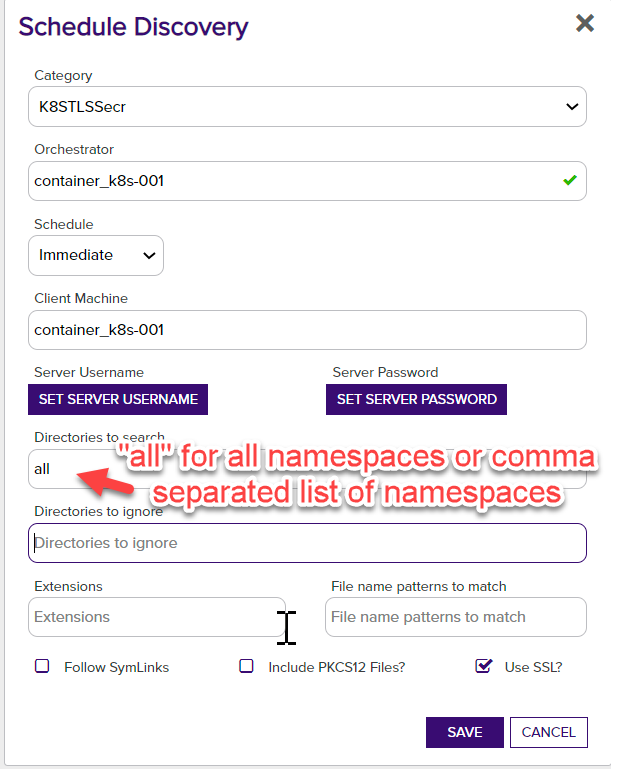
   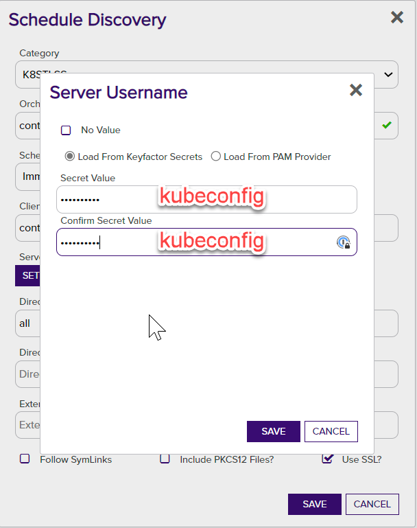
   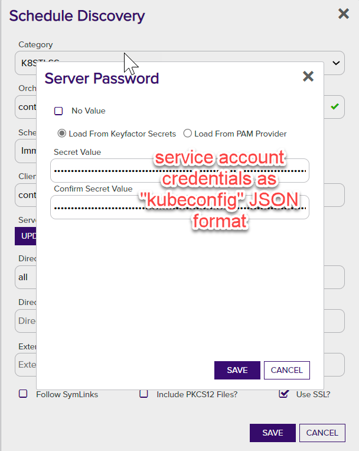
5. Click the "Save" button and wait for the Orchestrator to run the job. This may take some time depending on the number of certificates in the store and the Orchestrator's check-in schedule.


<details><summary>K8SJKS</summary>


### K8SJKS Discovery Job

For discovery of `K8SJKS` stores toy can use the following params to filter the certificates that will be discovered:
- `Directories to search` - comma separated list of namespaces to search for certificates OR `all` to search all 
namespaces. *This cannot be left blank.*
- `File name patterns to match` - comma separated list of K8S secret keys to search for PKCS12 or JKS data. Will use 
the following keys by default: `tls.pfx`,`tls.pkcs12`,`pfx`,`pkcs12`,`tls.jks`,`jks`.
</details>


<details><summary>K8SNS</summary>


### K8SNS Discovery Job

For discovery of K8SNS stores toy can use the following params to filter the certificates that will be discovered:
- `Directories to search` - comma separated list of namespaces to search for certificates OR `all` to search all 
namespaces. *This cannot be left blank.*
</details>


<details><summary>K8SPKCS12</summary>


### K8SPKCS12 Discovery Job

For discovery of `K8SPKCS12` stores toy can use the following params to filter the certificates that will be discovered:
- `Directories to search` - comma separated list of namespaces to search for certificates OR `all` to search all
  namespaces. *This cannot be left blank.*
- `File name patterns to match` - comma separated list of K8S secret keys to search for PKCS12 or PKCS12 data. Will use
  the following keys by default: `tls.pfx`,`tls.pkcs12`,`pfx`,`pkcs12`,`tls.pkcs12`,`pkcs12`.
</details>


<details><summary>K8SSecret</summary>


### K8SSecret Discovery Job

For discovery of K8SNS stores toy can use the following params to filter the certificates that will be discovered:
- `Directories to search` - comma separated list of namespaces to search for certificates OR `all` to search all
  namespaces. *This cannot be left blank.*
</details>


<details><summary>K8STLSSecr</summary>


### K8STLSSecr Discovery Job

For discovery of K8SNS stores toy can use the following params to filter the certificates that will be discovered:
- `Directories to search` - comma separated list of namespaces to search for certificates OR `all` to search all
  namespaces. *This cannot be left blank.*
</details>


## License

Apache License 2.0, see [LICENSE](LICENSE).

## Related Integrations

See all [Keyfactor Universal Orchestrator extensions](https://github.com/orgs/Keyfactor/repositories?q=orchestrator).