<h1 align="center" style="border-bottom: none">
    Kubernetes Universal Orchestrator Extension
</h1>

<p align="center">
  <!-- Badges -->

<a href="https://github.com/Keyfactor/Kubernetes Orchestrator Extension/releases"></a>


</p>

<p align="center">
  <!-- TOC -->
  <a href="#support">
    <b>Support</b>
  </a>
  ·
  <a href="#installation">
    <b>Installation</b>
  </a>
  ·
  <a href="#license">
    <b>License</b>
  </a>
  ·
  <a href="https://github.com/orgs/Keyfactor/repositories?q=orchestrator">
    <b>Related Integrations</b>
  </a>
</p>

## Overview

The Kubernetes Orchestrator allows for the remote management of certificate stores defined in a Kubernetes cluster.
The following types of Kubernetes resources are supported: Kubernetes secrets of type `kubernetes.io/tls` or `Opaque`, and
Kubernetes certificates of type `certificates.k8s.io/v1`.

The certificate store types that can be managed in the current version are:
- `K8SCert` - Kubernetes certificates of type `certificates.k8s.io/v1`
- `K8SSecret` - Kubernetes secrets of type `Opaque`
- `K8STLSSecr` - Kubernetes secrets of type `kubernetes.io/tls`
- `K8SCluster` - This allows for a single store to manage a Kubernetes cluster's secrets of type `Opaque` and `kubernetes.io/tls`.
  This can be thought of as a container of `K8SSecret` and `K8STLSSecr` stores across all Kubernetes namespaces.
- `K8SNS` - This allows for a single store to manage a Kubernetes namespace's secrets of type `Opaque` and `kubernetes.io/tls`.
  This can be thought of as a container of `K8SSecret` and `K8STLSSecr` stores for a single Kubernetes namespace.
- `K8SJKS` - Kubernetes secrets of type `Opaque` that contain one or more Java Keystore(s). These cannot be managed at the
  cluster or namespace level as they should all require unique credentials.
- `K8SPKCS12` - Kubernetes secrets of type `Opaque` that contain one or more PKCS12(s). These cannot be managed at the
  cluster or namespace level as they should all require unique credentials.

This orchestrator extension makes use of the Kubernetes API by using a service account
to communicate remotely with certificate stores. The service account must have the correct permissions
in order to perform the desired operations.  For more information on the required permissions, see the
[service account setup guide](#service-account-setup).

The Kubernetes Universal Orchestrator extension implements 7 Certificate Store Types. Depending on your use case, you may elect to use one, or all of these Certificate Store Types. Descriptions of each are provided below.
- [K8SCert](#K8SCert)
- [K8SCluster](#K8SCluster)
- [K8SJKS](#K8SJKS)
- [K8SNS](#K8SNS)
- [K8SPKCS12](#K8SPKCS12)
- [K8SSecret](#K8SSecret)
- [K8STLSSecr](#K8STLSSecr)

## Compatibility

This integration is compatible with Keyfactor Universal Orchestrator version 12.4 and later.

## Support

The Kubernetes Universal Orchestrator extension is supported by Keyfactor. If you require support for any issues or have feature request, please open a support ticket by either contacting your Keyfactor representative or via the Keyfactor Support Portal at https://support.keyfactor.com.

> If you want to contribute bug fixes or additional enhancements, use the **[Pull requests](../../pulls)** tab.

## Requirements & Prerequisites

Before installing the Kubernetes Universal Orchestrator extension, we recommend that you install [kfutil](https://github.com/Keyfactor/kfutil). Kfutil is a command-line tool that simplifies the process of creating store types, installing extensions, and instantiating certificate stores in Keyfactor Command.

### Kubernetes API Access

This orchestrator extension communicates with the Kubernetes API using credentials supplied as a `kubeconfig` JSON
object. Two authentication methods are supported — choose either based on your environment and security requirements.

The kubeconfig can be provided to the extension in one of two ways:
- As a raw JSON file that contains the credentials
- As a base64 encoded string that contains the credentials

In both cases set **Server Username** to `kubeconfig` and **Server Password** to the kubeconfig content.

#### Option 1: Service Account Token

A long-lived bearer token stored in a `kubernetes.io/service-account-token` Kubernetes Secret.
Simple to set up; the token does not expire unless manually rotated.

> **Note:** Since Kubernetes v1.22, service accounts no longer receive a token Secret automatically.
> The setup script and YAML provided below create the Secret explicitly — do not skip this step.

#### Option 2: Client Certificate

An X.509 client certificate and private key signed by the cluster CA. The certificate CN is used as the
Kubernetes user identity for RBAC — no ServiceAccount object is required. Certificates carry a defined
expiry (typically 1 year, set by cluster CA policy) and can be renewed through Keyfactor.

#### Option 3: In-Cluster / Pod Identity

When the Universal Orchestrator runs as a pod inside the cluster it is managing, it can authenticate using
the **projected service account token** that kubelet mounts automatically. The token is rotated every hour
with no intervention required, and no credentials are stored in Keyfactor Command for that cluster.
Leave **Server Password blank** in Command for stores in the UO's own cluster.

> **Scope:** This option only covers the cluster the UO pod runs in. Additional clusters are still
> configured via a kubeconfig (Options 1 or 2) in the Server Password field.

#### Setup

For full setup instructions, scripts, example kubeconfig files, and the UO deployment manifest for all
three authentication methods, see the [service account setup guide](./scripts/kubernetes/README.md).

## Certificate Store Types

To use the Kubernetes Universal Orchestrator extension, you **must** create the Certificate Store Types required for your use-case. This only needs to happen _once_ per Keyfactor Command instance.

The Kubernetes Universal Orchestrator extension implements 7 Certificate Store Types. Depending on your use case, you may elect to use one, or all of these Certificate Store Types.

### K8SCert

<details><summary>Click to expand details</summary>

### Overview

The `K8SCert` store type is used to manage Kubernetes Certificate Signing Requests (CSRs) of type `certificates.k8s.io/v1`.

**NOTE**: Only `inventory` and `discovery` of these resources is supported with this extension. CSRs are read-only - to provision certificates through CSRs, use the [k8s-csr-signer](https://github.com/Keyfactor/k8s-csr-signer).

#### Supported Operations

| Operation    | Is Supported |
|--------------|--------------|
| Add          | 🔲 Unchecked |
| Remove       | 🔲 Unchecked |
| Discovery    | ✅ Checked |
| Reenrollment | 🔲 Unchecked |
| Create       | 🔲 Unchecked |

#### Store Type Creation

##### Using kfutil:

   <details><summary>Click to expand K8SCert kfutil details</summary>

   ##### Using online definition from GitHub:
   ```shell
   # K8SCert
   kfutil store-types create K8SCert
   ```

   ##### Offline creation using integration-manifest file:
   ```shell
   kfutil store-types create --from-file integration-manifest.json
   ```
   </details>

#### Manual Creation

   <details><summary>Click to expand manual K8SCert details</summary>

   Create a store type called `K8SCert` with the attributes in the tables below:

   ##### Basic Tab
   | Attribute | Value | Description |
   | --------- | ----- | ----- |
   | Name | K8SCert | Display name for the store type (may be customized) |
   | Short Name | K8SCert | Short display name for the store type |
   | Capability | K8SCert | Store type name orchestrator will register with. Check the box to allow entry of value |
   | Supports Add | 🔲 Unchecked | Indicates that the Store Type supports Management Add |
   | Supports Remove | 🔲 Unchecked | Indicates that the Store Type supports Management Remove |
   | Supports Discovery | ✅ Checked | Indicates that the Store Type supports Discovery |
   | Supports Reenrollment | 🔲 Unchecked | Indicates that the Store Type supports Reenrollment |
   | Supports Create | 🔲 Unchecked | Indicates that the Store Type supports store creation |
   | Needs Server | ✅ Checked | Determines if a target server name is required when creating store |
   | Blueprint Allowed | 🔲 Unchecked | Determines if store type may be included in an Orchestrator blueprint |
   | Uses PowerShell | 🔲 Unchecked | Determines if underlying implementation is PowerShell |
   | Requires Store Password | 🔲 Unchecked | Enables users to optionally specify a store password when defining a Certificate Store. |
   | Supports Entry Password | 🔲 Unchecked | Determines if an individual entry within a store can have a password. |

   The Basic tab should look like this:

   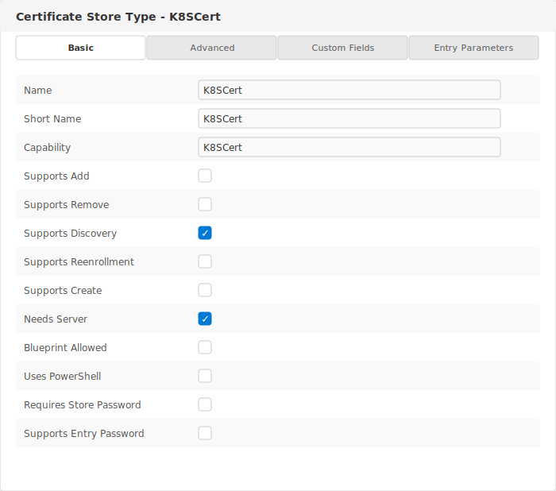

   ##### Advanced Tab
   | Attribute | Value | Description |
   | --------- | ----- | ----- |
   | Supports Custom Alias | Forbidden | Determines if an individual entry within a store can have a custom Alias. |
   | Private Key Handling | Forbidden | This determines if Keyfactor can send the private key associated with a certificate to the store. Required because IIS certificates without private keys would be invalid. |
   | PFX Password Style | Default | 'Default' - PFX password is randomly generated, 'Custom' - PFX password may be specified when the enrollment job is created (Requires the Allow Custom Password application setting to be enabled.) |

   The Advanced tab should look like this:

   

   > For Keyfactor **Command versions 24.4 and later**, a Certificate Format dropdown is available with PFX and PEM options. Ensure that **PFX** is selected, as this determines the format of new and renewed certificates sent to the Orchestrator during a Management job. Currently, all Keyfactor-supported Orchestrator extensions support only PFX.

   ##### Custom Fields Tab
   Custom fields operate at the certificate store level and are used to control how the orchestrator connects to the remote target server containing the certificate store to be managed. The following custom fields should be added to the store type:

   | Name | Display Name | Description | Type | Default Value/Options | Required |
   | ---- | ------------ | ---- | --------------------- | -------- | ----------- |
   | ServerUsername | Server Username | This should be no value or `kubeconfig` | Secret |  | 🔲 Unchecked |
   | ServerPassword | Server Password | The credentials to use to connect to the K8S cluster API. This needs to be in `kubeconfig` format. Example: https://github.com/Keyfactor/k8s-orchestrator/tree/main/scripts/kubernetes#example-service-account-json | Secret |  | ✅ Checked |
   | KubeSecretName | KubeSecretName | The name of a specific CSR to inventory. Leave empty or set to '*' to inventory ALL issued CSRs in the cluster. | String |  | 🔲 Unchecked |

   The Custom Fields tab should look like this:

   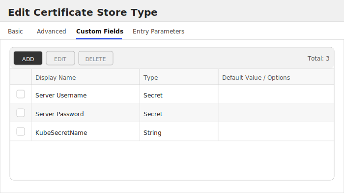

   </details>
</details>

### K8SCluster

<details><summary>Click to expand details</summary>

### Overview

The `K8SCluster` store type allows for a single store to manage a Kubernetes cluster's secrets of type `Opaque` and `kubernetes.io/tls`.

#### Supported Operations

| Operation    | Is Supported |
|--------------|--------------|
| Add          | ✅ Checked |
| Remove       | ✅ Checked |
| Discovery    | 🔲 Unchecked |
| Reenrollment | 🔲 Unchecked |
| Create       | ✅ Checked |

#### Store Type Creation

##### Using kfutil:

   <details><summary>Click to expand K8SCluster kfutil details</summary>

   ##### Using online definition from GitHub:
   ```shell
   # K8SCluster
   kfutil store-types create K8SCluster
   ```

   ##### Offline creation using integration-manifest file:
   ```shell
   kfutil store-types create --from-file integration-manifest.json
   ```
   </details>

#### Manual Creation

   <details><summary>Click to expand manual K8SCluster details</summary>

   Create a store type called `K8SCluster` with the attributes in the tables below:

   ##### Basic Tab
   | Attribute | Value | Description |
   | --------- | ----- | ----- |
   | Name | K8SCluster | Display name for the store type (may be customized) |
   | Short Name | K8SCluster | Short display name for the store type |
   | Capability | K8SCluster | Store type name orchestrator will register with. Check the box to allow entry of value |
   | Supports Add | ✅ Checked | Indicates that the Store Type supports Management Add |
   | Supports Remove | ✅ Checked | Indicates that the Store Type supports Management Remove |
   | Supports Discovery | 🔲 Unchecked | Indicates that the Store Type supports Discovery |
   | Supports Reenrollment | 🔲 Unchecked | Indicates that the Store Type supports Reenrollment |
   | Supports Create | ✅ Checked | Indicates that the Store Type supports store creation |
   | Needs Server | ✅ Checked | Determines if a target server name is required when creating store |
   | Blueprint Allowed | 🔲 Unchecked | Determines if store type may be included in an Orchestrator blueprint |
   | Uses PowerShell | 🔲 Unchecked | Determines if underlying implementation is PowerShell |
   | Requires Store Password | 🔲 Unchecked | Enables users to optionally specify a store password when defining a Certificate Store. |
   | Supports Entry Password | 🔲 Unchecked | Determines if an individual entry within a store can have a password. |

   The Basic tab should look like this:

   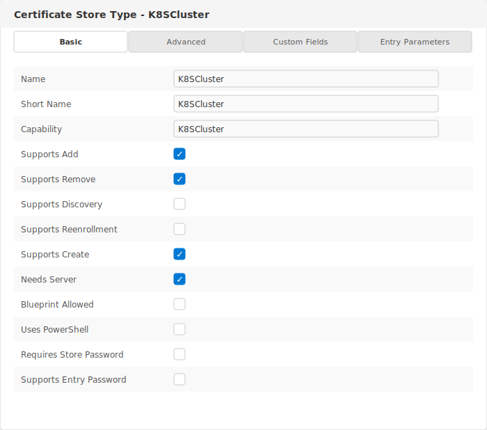

   ##### Advanced Tab
   | Attribute | Value | Description |
   | --------- | ----- | ----- |
   | Supports Custom Alias | Required | Determines if an individual entry within a store can have a custom Alias. |
   | Private Key Handling | Optional | This determines if Keyfactor can send the private key associated with a certificate to the store. Required because IIS certificates without private keys would be invalid. |
   | PFX Password Style | Default | 'Default' - PFX password is randomly generated, 'Custom' - PFX password may be specified when the enrollment job is created (Requires the Allow Custom Password application setting to be enabled.) |

   The Advanced tab should look like this:

   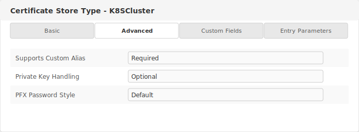

   > For Keyfactor **Command versions 24.4 and later**, a Certificate Format dropdown is available with PFX and PEM options. Ensure that **PFX** is selected, as this determines the format of new and renewed certificates sent to the Orchestrator during a Management job. Currently, all Keyfactor-supported Orchestrator extensions support only PFX.

   ##### Custom Fields Tab
   Custom fields operate at the certificate store level and are used to control how the orchestrator connects to the remote target server containing the certificate store to be managed. The following custom fields should be added to the store type:

   | Name | Display Name | Description | Type | Default Value/Options | Required |
   | ---- | ------------ | ---- | --------------------- | -------- | ----------- |
   | IncludeCertChain | Include Certificate Chain | Will default to `true` if not set. If set to `false` only the leaf cert will be deployed. Note: If the certificate in Keyfactor Command does not have a private key, it will be sent in DER format (leaf certificate only), and the chain cannot be included regardless of this setting. | Bool | true | 🔲 Unchecked |
   | SeparateChain | Separate Chain | Will default to `false` if not set. Set this to `true` if you want to deploy certificate chain to the `ca.crt` field for Opaque and tls secrets. | Bool | false | 🔲 Unchecked |
   | ServerUsername | Server Username | This should be no value or `kubeconfig` | Secret |  | 🔲 Unchecked |
   | ServerPassword | Server Password | The credentials to use to connect to the K8S cluster API. This needs to be in `kubeconfig` format. Example: https://github.com/Keyfactor/k8s-orchestrator/tree/main/scripts/kubernetes#example-service-account-json | Secret |  | 🔲 Unchecked |

   The Custom Fields tab should look like this:

   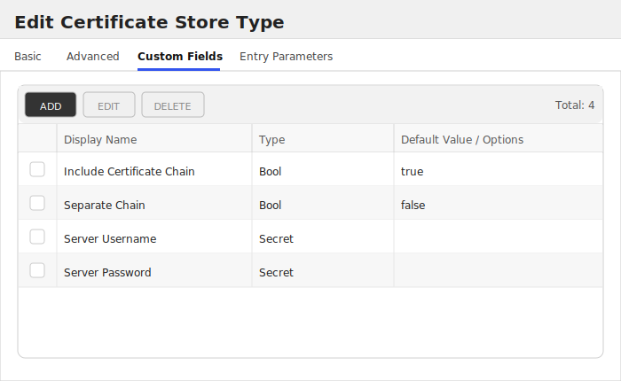

   </details>
</details>

### K8SJKS

<details><summary>Click to expand details</summary>

### Overview

The `K8SJKS` store type is used to manage Kubernetes secrets of type `Opaque`.  These secrets
must have a field that ends in `.jks`. The orchestrator will inventory and manage using a *custom alias* of the following
pattern: `<k8s_secret_field_name>/<keystore_alias>`.  For example, if the secret has a field named `mykeystore.jks` and
the keystore contains a certificate with an alias of `mycert`, the orchestrator will manage the certificate using the
alias `mykeystore.jks/mycert`. *NOTE* *This store type cannot be managed at the `cluster` or `namespace` level as they
should all require unique credentials.*

#### Supported Operations

| Operation    | Is Supported |
|--------------|--------------|
| Add          | ✅ Checked |
| Remove       | ✅ Checked |
| Discovery    | ✅ Checked |
| Reenrollment | 🔲 Unchecked |
| Create       | ✅ Checked |

#### Store Type Creation

##### Using kfutil:

   <details><summary>Click to expand K8SJKS kfutil details</summary>

   ##### Using online definition from GitHub:
   ```shell
   # K8SJKS
   kfutil store-types create K8SJKS
   ```

   ##### Offline creation using integration-manifest file:
   ```shell
   kfutil store-types create --from-file integration-manifest.json
   ```
   </details>

#### Manual Creation

   <details><summary>Click to expand manual K8SJKS details</summary>

   Create a store type called `K8SJKS` with the attributes in the tables below:

   ##### Basic Tab
   | Attribute | Value | Description |
   | --------- | ----- | ----- |
   | Name | K8SJKS | Display name for the store type (may be customized) |
   | Short Name | K8SJKS | Short display name for the store type |
   | Capability | K8SJKS | Store type name orchestrator will register with. Check the box to allow entry of value |
   | Supports Add | ✅ Checked | Indicates that the Store Type supports Management Add |
   | Supports Remove | ✅ Checked | Indicates that the Store Type supports Management Remove |
   | Supports Discovery | ✅ Checked | Indicates that the Store Type supports Discovery |
   | Supports Reenrollment | 🔲 Unchecked | Indicates that the Store Type supports Reenrollment |
   | Supports Create | ✅ Checked | Indicates that the Store Type supports store creation |
   | Needs Server | ✅ Checked | Determines if a target server name is required when creating store |
   | Blueprint Allowed | 🔲 Unchecked | Determines if store type may be included in an Orchestrator blueprint |
   | Uses PowerShell | 🔲 Unchecked | Determines if underlying implementation is PowerShell |
   | Requires Store Password | ✅ Checked | Enables users to optionally specify a store password when defining a Certificate Store. |
   | Supports Entry Password | 🔲 Unchecked | Determines if an individual entry within a store can have a password. |

   The Basic tab should look like this:

   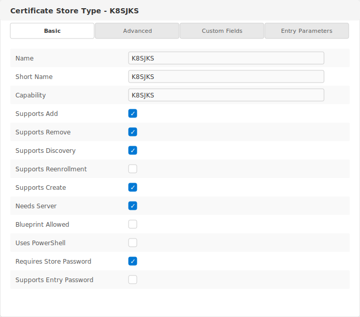

   ##### Advanced Tab
   | Attribute | Value | Description |
   | --------- | ----- | ----- |
   | Supports Custom Alias | Required | Determines if an individual entry within a store can have a custom Alias. |
   | Private Key Handling | Optional | This determines if Keyfactor can send the private key associated with a certificate to the store. Required because IIS certificates without private keys would be invalid. |
   | PFX Password Style | Default | 'Default' - PFX password is randomly generated, 'Custom' - PFX password may be specified when the enrollment job is created (Requires the Allow Custom Password application setting to be enabled.) |

   The Advanced tab should look like this:

   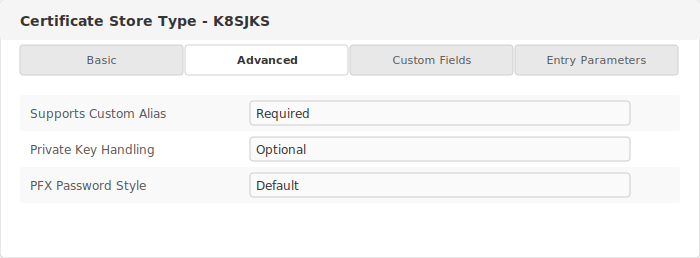

   > For Keyfactor **Command versions 24.4 and later**, a Certificate Format dropdown is available with PFX and PEM options. Ensure that **PFX** is selected, as this determines the format of new and renewed certificates sent to the Orchestrator during a Management job. Currently, all Keyfactor-supported Orchestrator extensions support only PFX.

   ##### Custom Fields Tab
   Custom fields operate at the certificate store level and are used to control how the orchestrator connects to the remote target server containing the certificate store to be managed. The following custom fields should be added to the store type:

   | Name | Display Name | Description | Type | Default Value/Options | Required |
   | ---- | ------------ | ---- | --------------------- | -------- | ----------- |
   | KubeNamespace | KubeNamespace | The K8S namespace to use to manage the K8S secret object. | String | default | 🔲 Unchecked |
   | KubeSecretName | KubeSecretName | The name of the K8S secret object. | String |  | 🔲 Unchecked |
   | KubeSecretType | KubeSecretType | DEPRECATED: This property is deprecated and will be removed in a future release. The secret type is now automatically derived from the store type. This defaults to and must be `jks`. | String | jks | 🔲 Unchecked |
   | CertificateDataFieldName | CertificateDataFieldName | The field name to use when looking for certificate data in the K8S secret. | String |  | 🔲 Unchecked |
   | PasswordFieldName | PasswordFieldName | The field name to use when looking for the JKS keystore password in the K8S secret. This is either the field name to look at on the same secret, or if `PasswordIsK8SSecret` is set to `true`, the field name to look at on the secret specified in `StorePasswordPath`. | String | password | 🔲 Unchecked |
   | PasswordIsK8SSecret | PasswordIsK8SSecret | Indicates whether the password to the JKS keystore is stored in a separate K8S secret. | Bool | false | 🔲 Unchecked |
   | IncludeCertChain | Include Certificate Chain | Will default to `true` if not set. If set to `false` only the leaf cert will be deployed. Note: If the certificate in Keyfactor Command does not have a private key, it will be sent in DER format (leaf certificate only), and the chain cannot be included regardless of this setting. | Bool | true | 🔲 Unchecked |
   | StorePasswordPath | StorePasswordPath | The path to the K8S secret object to use as the password to the JKS keystore. Example: `<namespace>/<secret_name>` | String |  | 🔲 Unchecked |
   | ServerUsername | Server Username | This should be no value or `kubeconfig` | Secret |  | 🔲 Unchecked |
   | ServerPassword | Server Password | The credentials to use to connect to the K8S cluster API. This needs to be in `kubeconfig` format. Example: https://github.com/Keyfactor/k8s-orchestrator/tree/main/scripts/kubernetes#example-service-account-json | Secret |  | 🔲 Unchecked |

   The Custom Fields tab should look like this:

   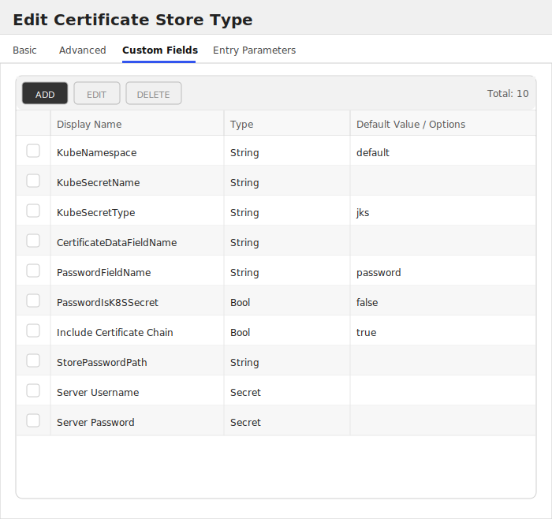

   </details>
</details>

### K8SNS

<details><summary>Click to expand details</summary>

### Overview

The `K8SNS` store type is used to manage Kubernetes secrets of type `kubernetes.io/tls` and/or type `Opaque` in a single
Keyfactor Command certificate store. This store type manages all secrets within a specific Kubernetes namespace.

#### Supported Operations

| Operation    | Is Supported |
|--------------|--------------|
| Add          | ✅ Checked |
| Remove       | ✅ Checked |
| Discovery    | ✅ Checked |
| Reenrollment | 🔲 Unchecked |
| Create       | ✅ Checked |

#### Store Type Creation

##### Using kfutil:

   <details><summary>Click to expand K8SNS kfutil details</summary>

   ##### Using online definition from GitHub:
   ```shell
   # K8SNS
   kfutil store-types create K8SNS
   ```

   ##### Offline creation using integration-manifest file:
   ```shell
   kfutil store-types create --from-file integration-manifest.json
   ```
   </details>

#### Manual Creation

   <details><summary>Click to expand manual K8SNS details</summary>

   Create a store type called `K8SNS` with the attributes in the tables below:

   ##### Basic Tab
   | Attribute | Value | Description |
   | --------- | ----- | ----- |
   | Name | K8SNS | Display name for the store type (may be customized) |
   | Short Name | K8SNS | Short display name for the store type |
   | Capability | K8SNS | Store type name orchestrator will register with. Check the box to allow entry of value |
   | Supports Add | ✅ Checked | Indicates that the Store Type supports Management Add |
   | Supports Remove | ✅ Checked | Indicates that the Store Type supports Management Remove |
   | Supports Discovery | ✅ Checked | Indicates that the Store Type supports Discovery |
   | Supports Reenrollment | 🔲 Unchecked | Indicates that the Store Type supports Reenrollment |
   | Supports Create | ✅ Checked | Indicates that the Store Type supports store creation |
   | Needs Server | ✅ Checked | Determines if a target server name is required when creating store |
   | Blueprint Allowed | 🔲 Unchecked | Determines if store type may be included in an Orchestrator blueprint |
   | Uses PowerShell | 🔲 Unchecked | Determines if underlying implementation is PowerShell |
   | Requires Store Password | 🔲 Unchecked | Enables users to optionally specify a store password when defining a Certificate Store. |
   | Supports Entry Password | 🔲 Unchecked | Determines if an individual entry within a store can have a password. |

   The Basic tab should look like this:

   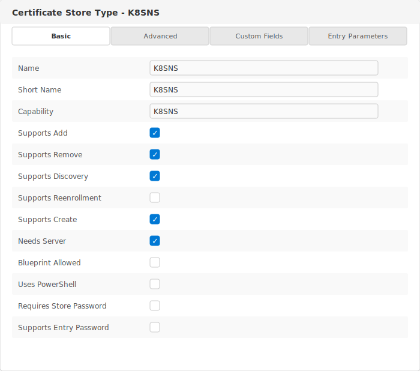

   ##### Advanced Tab
   | Attribute | Value | Description |
   | --------- | ----- | ----- |
   | Supports Custom Alias | Required | Determines if an individual entry within a store can have a custom Alias. |
   | Private Key Handling | Optional | This determines if Keyfactor can send the private key associated with a certificate to the store. Required because IIS certificates without private keys would be invalid. |
   | PFX Password Style | Default | 'Default' - PFX password is randomly generated, 'Custom' - PFX password may be specified when the enrollment job is created (Requires the Allow Custom Password application setting to be enabled.) |

   The Advanced tab should look like this:

   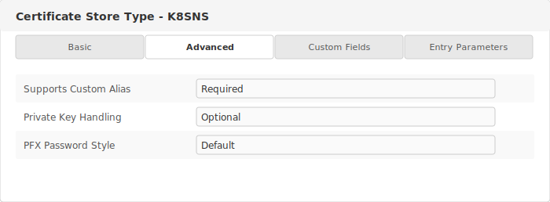

   > For Keyfactor **Command versions 24.4 and later**, a Certificate Format dropdown is available with PFX and PEM options. Ensure that **PFX** is selected, as this determines the format of new and renewed certificates sent to the Orchestrator during a Management job. Currently, all Keyfactor-supported Orchestrator extensions support only PFX.

   ##### Custom Fields Tab
   Custom fields operate at the certificate store level and are used to control how the orchestrator connects to the remote target server containing the certificate store to be managed. The following custom fields should be added to the store type:

   | Name | Display Name | Description | Type | Default Value/Options | Required |
   | ---- | ------------ | ---- | --------------------- | -------- | ----------- |
   | KubeNamespace | Kube Namespace | The K8S namespace to use to manage the K8S secret object. | String | default | 🔲 Unchecked |
   | IncludeCertChain | Include Certificate Chain | Will default to `true` if not set. If set to `false` only the leaf cert will be deployed. Note: If the certificate in Keyfactor Command does not have a private key, it will be sent in DER format (leaf certificate only), and the chain cannot be included regardless of this setting. | Bool | true | 🔲 Unchecked |
   | SeparateChain | Separate Chain | Will default to `false` if not set. Set this to `true` if you want to deploy certificate chain to the `ca.crt` field for Opaque and tls secrets. | Bool | false | 🔲 Unchecked |
   | ServerUsername | Server Username | This should be no value or `kubeconfig` | Secret |  | 🔲 Unchecked |
   | ServerPassword | Server Password | The credentials to use to connect to the K8S cluster API. This needs to be in `kubeconfig` format. Example: https://github.com/Keyfactor/k8s-orchestrator/tree/main/scripts/kubernetes#example-service-account-json | Secret |  | 🔲 Unchecked |

   The Custom Fields tab should look like this:

   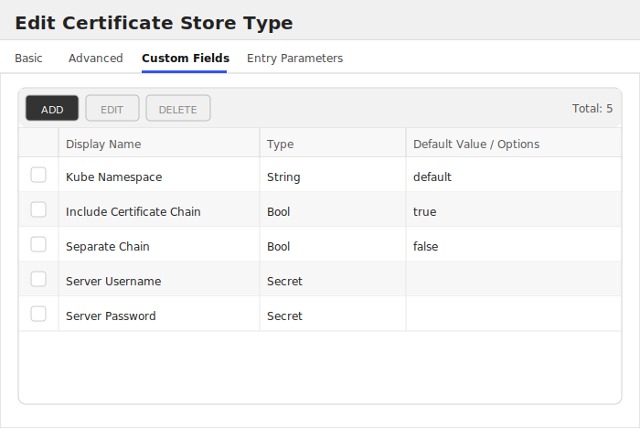

   </details>
</details>

### K8SPKCS12

<details><summary>Click to expand details</summary>

### Overview

The `K8SPKCS12` store type is used to manage Kubernetes secrets of type `Opaque`.  These secrets
must have a field that ends in `.pkcs12`. The orchestrator will inventory and manage using a *custom alias* of the following
pattern: `<k8s_secret_field_name>/<keystore_alias>`.  For example, if the secret has a field named `mykeystore.pkcs12` and
the keystore contains a certificate with an alias of `mycert`, the orchestrator will manage the certificate using the
alias `mykeystore.pkcs12/mycert`. *NOTE* *This store type cannot be managed at the `cluster` or `namespace` level as they
should all require unique credentials.*

#### Supported Operations

| Operation    | Is Supported |
|--------------|--------------|
| Add          | ✅ Checked |
| Remove       | ✅ Checked |
| Discovery    | ✅ Checked |
| Reenrollment | 🔲 Unchecked |
| Create       | ✅ Checked |

#### Store Type Creation

##### Using kfutil:

   <details><summary>Click to expand K8SPKCS12 kfutil details</summary>

   ##### Using online definition from GitHub:
   ```shell
   # K8SPKCS12
   kfutil store-types create K8SPKCS12
   ```

   ##### Offline creation using integration-manifest file:
   ```shell
   kfutil store-types create --from-file integration-manifest.json
   ```
   </details>

#### Manual Creation

   <details><summary>Click to expand manual K8SPKCS12 details</summary>

   Create a store type called `K8SPKCS12` with the attributes in the tables below:

   ##### Basic Tab
   | Attribute | Value | Description |
   | --------- | ----- | ----- |
   | Name | K8SPKCS12 | Display name for the store type (may be customized) |
   | Short Name | K8SPKCS12 | Short display name for the store type |
   | Capability | K8SPKCS12 | Store type name orchestrator will register with. Check the box to allow entry of value |
   | Supports Add | ✅ Checked | Indicates that the Store Type supports Management Add |
   | Supports Remove | ✅ Checked | Indicates that the Store Type supports Management Remove |
   | Supports Discovery | ✅ Checked | Indicates that the Store Type supports Discovery |
   | Supports Reenrollment | 🔲 Unchecked | Indicates that the Store Type supports Reenrollment |
   | Supports Create | ✅ Checked | Indicates that the Store Type supports store creation |
   | Needs Server | ✅ Checked | Determines if a target server name is required when creating store |
   | Blueprint Allowed | 🔲 Unchecked | Determines if store type may be included in an Orchestrator blueprint |
   | Uses PowerShell | 🔲 Unchecked | Determines if underlying implementation is PowerShell |
   | Requires Store Password | ✅ Checked | Enables users to optionally specify a store password when defining a Certificate Store. |
   | Supports Entry Password | 🔲 Unchecked | Determines if an individual entry within a store can have a password. |

   The Basic tab should look like this:

   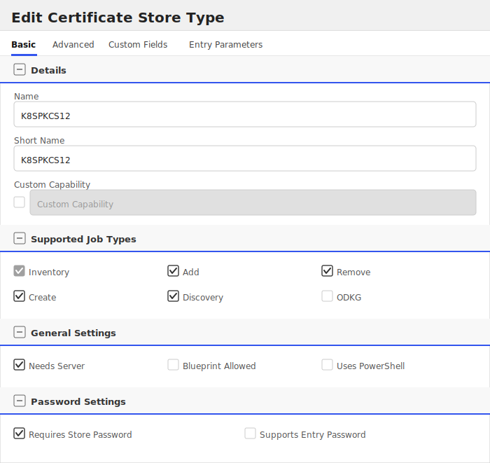

   ##### Advanced Tab
   | Attribute | Value | Description |
   | --------- | ----- | ----- |
   | Supports Custom Alias | Required | Determines if an individual entry within a store can have a custom Alias. |
   | Private Key Handling | Optional | This determines if Keyfactor can send the private key associated with a certificate to the store. Required because IIS certificates without private keys would be invalid. |
   | PFX Password Style | Default | 'Default' - PFX password is randomly generated, 'Custom' - PFX password may be specified when the enrollment job is created (Requires the Allow Custom Password application setting to be enabled.) |

   The Advanced tab should look like this:

   

   > For Keyfactor **Command versions 24.4 and later**, a Certificate Format dropdown is available with PFX and PEM options. Ensure that **PFX** is selected, as this determines the format of new and renewed certificates sent to the Orchestrator during a Management job. Currently, all Keyfactor-supported Orchestrator extensions support only PFX.

   ##### Custom Fields Tab
   Custom fields operate at the certificate store level and are used to control how the orchestrator connects to the remote target server containing the certificate store to be managed. The following custom fields should be added to the store type:

   | Name | Display Name | Description | Type | Default Value/Options | Required |
   | ---- | ------------ | ---- | --------------------- | -------- | ----------- |
   | IncludeCertChain | Include Certificate Chain | Will default to `true` if not set. If set to `false` only the leaf cert will be deployed. Note: If the certificate in Keyfactor Command does not have a private key, it will be sent in DER format (leaf certificate only), and the chain cannot be included regardless of this setting. | Bool | true | 🔲 Unchecked |
   | CertificateDataFieldName | CertificateDataFieldName |  | String | .p12 | ✅ Checked |
   | PasswordFieldName | Password Field Name | The field name to use when looking for the PKCS12 keystore password in the K8S secret. This is either the field name to look at on the same secret, or if `PasswordIsK8SSecret` is set to `true`, the field name to look at on the secret specified in `StorePasswordPath`. | String | password | 🔲 Unchecked |
   | PasswordIsK8SSecret | Password Is K8S Secret | Indicates whether the password to the PKCS12 keystore is stored in a separate K8S secret object. | Bool | false | 🔲 Unchecked |
   | KubeNamespace | Kube Namespace | The K8S namespace to use to manage the K8S secret object. | String | default | 🔲 Unchecked |
   | KubeSecretName | Kube Secret Name | The name of the K8S secret object. | String |  | 🔲 Unchecked |
   | ServerUsername | Server Username | This should be no value or `kubeconfig` | Secret |  | 🔲 Unchecked |
   | ServerPassword | Server Password | The credentials to use to connect to the K8S cluster API. This needs to be in `kubeconfig` format. Example: https://github.com/Keyfactor/k8s-orchestrator/tree/main/scripts/kubernetes#example-service-account-json | Secret |  | 🔲 Unchecked |
   | KubeSecretType | Kube Secret Type | DEPRECATED: This property is deprecated and will be removed in a future release. The secret type is now automatically derived from the store type. This defaults to and must be `pkcs12`. | String | pkcs12 | 🔲 Unchecked |
   | StorePasswordPath | StorePasswordPath | The path to the K8S secret object to use as the password to the PFX/PKCS12 data. Example: `<namespace>/<secret_name>` | String |  | 🔲 Unchecked |

   The Custom Fields tab should look like this:

   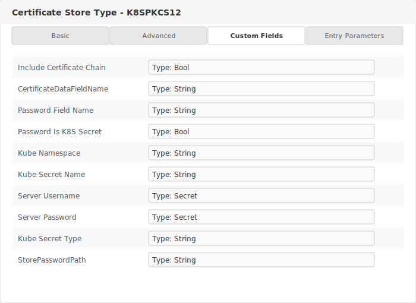

   </details>
</details>

### K8SSecret

<details><summary>Click to expand details</summary>

### Overview

The `K8SSecret` store type is used to manage Kubernetes secrets of type `Opaque`.

#### Supported Operations

| Operation    | Is Supported |
|--------------|--------------|
| Add          | ✅ Checked |
| Remove       | ✅ Checked |
| Discovery    | ✅ Checked |
| Reenrollment | 🔲 Unchecked |
| Create       | ✅ Checked |

#### Store Type Creation

##### Using kfutil:

   <details><summary>Click to expand K8SSecret kfutil details</summary>

   ##### Using online definition from GitHub:
   ```shell
   # K8SSecret
   kfutil store-types create K8SSecret
   ```

   ##### Offline creation using integration-manifest file:
   ```shell
   kfutil store-types create --from-file integration-manifest.json
   ```
   </details>

#### Manual Creation

   <details><summary>Click to expand manual K8SSecret details</summary>

   Create a store type called `K8SSecret` with the attributes in the tables below:

   ##### Basic Tab
   | Attribute | Value | Description |
   | --------- | ----- | ----- |
   | Name | K8SSecret | Display name for the store type (may be customized) |
   | Short Name | K8SSecret | Short display name for the store type |
   | Capability | K8SSecret | Store type name orchestrator will register with. Check the box to allow entry of value |
   | Supports Add | ✅ Checked | Indicates that the Store Type supports Management Add |
   | Supports Remove | ✅ Checked | Indicates that the Store Type supports Management Remove |
   | Supports Discovery | ✅ Checked | Indicates that the Store Type supports Discovery |
   | Supports Reenrollment | 🔲 Unchecked | Indicates that the Store Type supports Reenrollment |
   | Supports Create | ✅ Checked | Indicates that the Store Type supports store creation |
   | Needs Server | ✅ Checked | Determines if a target server name is required when creating store |
   | Blueprint Allowed | 🔲 Unchecked | Determines if store type may be included in an Orchestrator blueprint |
   | Uses PowerShell | 🔲 Unchecked | Determines if underlying implementation is PowerShell |
   | Requires Store Password | 🔲 Unchecked | Enables users to optionally specify a store password when defining a Certificate Store. |
   | Supports Entry Password | 🔲 Unchecked | Determines if an individual entry within a store can have a password. |

   The Basic tab should look like this:

   

   ##### Advanced Tab
   | Attribute | Value | Description |
   | --------- | ----- | ----- |
   | Supports Custom Alias | Forbidden | Determines if an individual entry within a store can have a custom Alias. |
   | Private Key Handling | Optional | This determines if Keyfactor can send the private key associated with a certificate to the store. Required because IIS certificates without private keys would be invalid. |
   | PFX Password Style | Default | 'Default' - PFX password is randomly generated, 'Custom' - PFX password may be specified when the enrollment job is created (Requires the Allow Custom Password application setting to be enabled.) |

   The Advanced tab should look like this:

   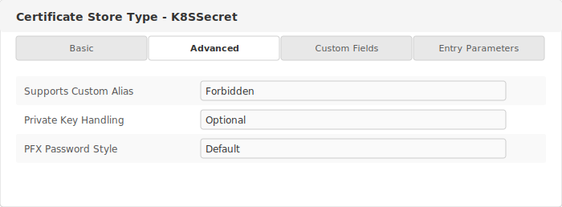

   > For Keyfactor **Command versions 24.4 and later**, a Certificate Format dropdown is available with PFX and PEM options. Ensure that **PFX** is selected, as this determines the format of new and renewed certificates sent to the Orchestrator during a Management job. Currently, all Keyfactor-supported Orchestrator extensions support only PFX.

   ##### Custom Fields Tab
   Custom fields operate at the certificate store level and are used to control how the orchestrator connects to the remote target server containing the certificate store to be managed. The following custom fields should be added to the store type:

   | Name | Display Name | Description | Type | Default Value/Options | Required |
   | ---- | ------------ | ---- | --------------------- | -------- | ----------- |
   | KubeNamespace | KubeNamespace | The K8S namespace to use to manage the K8S secret object. | String |  | 🔲 Unchecked |
   | KubeSecretName | KubeSecretName | The name of the K8S secret object. | String |  | 🔲 Unchecked |
   | KubeSecretType | KubeSecretType | DEPRECATED: This property is deprecated and will be removed in a future release. The secret type is now automatically derived from the store type. This defaults to and must be `secret`. | String | secret | 🔲 Unchecked |
   | IncludeCertChain | Include Certificate Chain | Will default to `true` if not set. If set to `false` only the leaf cert will be deployed. Note: If the certificate in Keyfactor Command does not have a private key, it will be sent in DER format (leaf certificate only), and the chain cannot be included regardless of this setting. | Bool | true | 🔲 Unchecked |
   | SeparateChain | Separate Chain | Will default to `false` if not set. Set this to `true` if you want to deploy certificate chain to the `ca.crt` field for Opaque and tls secrets. | Bool | false | 🔲 Unchecked |
   | ServerUsername | Server Username | This should be no value or `kubeconfig` | Secret |  | 🔲 Unchecked |
   | ServerPassword | Server Password | The credentials to use to connect to the K8S cluster API. This needs to be in `kubeconfig` format. Example: https://github.com/Keyfactor/k8s-orchestrator/tree/main/scripts/kubernetes#example-service-account-json | Secret |  | 🔲 Unchecked |

   The Custom Fields tab should look like this:

   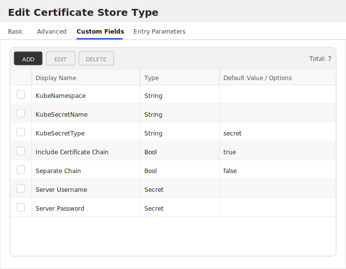

   </details>
</details>

### K8STLSSecr

<details><summary>Click to expand details</summary>

### Overview

The `K8STLSSecr` store type is used to manage Kubernetes secrets of type `kubernetes.io/tls`.

#### Supported Operations

| Operation    | Is Supported |
|--------------|--------------|
| Add          | ✅ Checked |
| Remove       | ✅ Checked |
| Discovery    | ✅ Checked |
| Reenrollment | 🔲 Unchecked |
| Create       | ✅ Checked |

#### Store Type Creation

##### Using kfutil:

   <details><summary>Click to expand K8STLSSecr kfutil details</summary>

   ##### Using online definition from GitHub:
   ```shell
   # K8STLSSecr
   kfutil store-types create K8STLSSecr
   ```

   ##### Offline creation using integration-manifest file:
   ```shell
   kfutil store-types create --from-file integration-manifest.json
   ```
   </details>

#### Manual Creation

   <details><summary>Click to expand manual K8STLSSecr details</summary>

   Create a store type called `K8STLSSecr` with the attributes in the tables below:

   ##### Basic Tab
   | Attribute | Value | Description |
   | --------- | ----- | ----- |
   | Name | K8STLSSecr | Display name for the store type (may be customized) |
   | Short Name | K8STLSSecr | Short display name for the store type |
   | Capability | K8STLSSecr | Store type name orchestrator will register with. Check the box to allow entry of value |
   | Supports Add | ✅ Checked | Indicates that the Store Type supports Management Add |
   | Supports Remove | ✅ Checked | Indicates that the Store Type supports Management Remove |
   | Supports Discovery | ✅ Checked | Indicates that the Store Type supports Discovery |
   | Supports Reenrollment | 🔲 Unchecked | Indicates that the Store Type supports Reenrollment |
   | Supports Create | ✅ Checked | Indicates that the Store Type supports store creation |
   | Needs Server | ✅ Checked | Determines if a target server name is required when creating store |
   | Blueprint Allowed | 🔲 Unchecked | Determines if store type may be included in an Orchestrator blueprint |
   | Uses PowerShell | 🔲 Unchecked | Determines if underlying implementation is PowerShell |
   | Requires Store Password | 🔲 Unchecked | Enables users to optionally specify a store password when defining a Certificate Store. |
   | Supports Entry Password | 🔲 Unchecked | Determines if an individual entry within a store can have a password. |

   The Basic tab should look like this:

   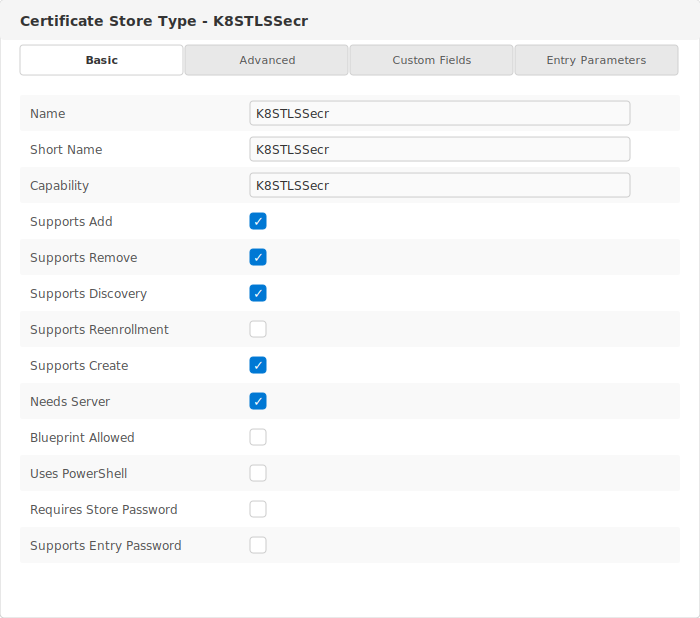

   ##### Advanced Tab
   | Attribute | Value | Description |
   | --------- | ----- | ----- |
   | Supports Custom Alias | Forbidden | Determines if an individual entry within a store can have a custom Alias. |
   | Private Key Handling | Optional | This determines if Keyfactor can send the private key associated with a certificate to the store. Required because IIS certificates without private keys would be invalid. |
   | PFX Password Style | Default | 'Default' - PFX password is randomly generated, 'Custom' - PFX password may be specified when the enrollment job is created (Requires the Allow Custom Password application setting to be enabled.) |

   The Advanced tab should look like this:

   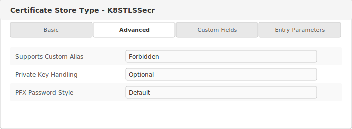

   > For Keyfactor **Command versions 24.4 and later**, a Certificate Format dropdown is available with PFX and PEM options. Ensure that **PFX** is selected, as this determines the format of new and renewed certificates sent to the Orchestrator during a Management job. Currently, all Keyfactor-supported Orchestrator extensions support only PFX.

   ##### Custom Fields Tab
   Custom fields operate at the certificate store level and are used to control how the orchestrator connects to the remote target server containing the certificate store to be managed. The following custom fields should be added to the store type:

   | Name | Display Name | Description | Type | Default Value/Options | Required |
   | ---- | ------------ | ---- | --------------------- | -------- | ----------- |
   | KubeNamespace | KubeNamespace | The K8S namespace to use to manage the K8S secret object. | String |  | 🔲 Unchecked |
   | KubeSecretName | KubeSecretName | The name of the K8S secret object. | String |  | 🔲 Unchecked |
   | KubeSecretType | KubeSecretType | DEPRECATED: This property is deprecated and will be removed in a future release. The secret type is now automatically derived from the store type. This defaults to and must be `tls_secret`. | String | tls_secret | 🔲 Unchecked |
   | IncludeCertChain | Include Certificate Chain | Will default to `true` if not set. If set to `false` only the leaf cert will be deployed. Note: If the certificate in Keyfactor Command does not have a private key, it will be sent in DER format (leaf certificate only), and the chain cannot be included regardless of this setting. | Bool | true | 🔲 Unchecked |
   | SeparateChain | Separate Chain | Will default to `false` if not set. Set this to `true` if you want to deploy certificate chain to the `ca.crt` field for Opaque and tls secrets. | Bool | false | 🔲 Unchecked |
   | ServerUsername | Server Username | This should be no value or `kubeconfig` | Secret |  | 🔲 Unchecked |
   | ServerPassword | Server Password | The credentials to use to connect to the K8S cluster API. This needs to be in `kubeconfig` format. Example: https://github.com/Keyfactor/k8s-orchestrator/tree/main/scripts/kubernetes#example-service-account-json | Secret |  | 🔲 Unchecked |

   The Custom Fields tab should look like this:

   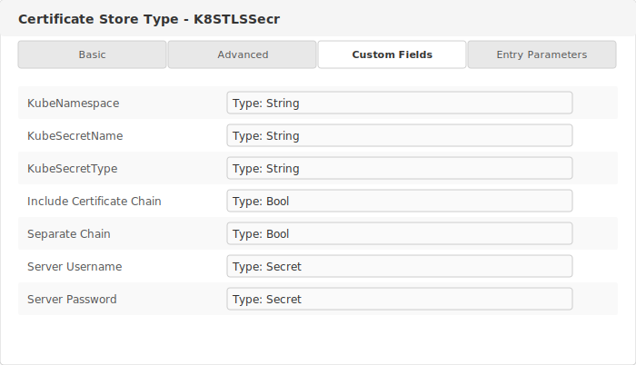

   </details>
</details>

## Installation

1. **Download the latest Kubernetes Universal Orchestrator extension from GitHub.**

    Navigate to the [Kubernetes Universal Orchestrator extension GitHub version page](https://github.com/Keyfactor/Kubernetes Orchestrator Extension/releases/latest). Refer to the compatibility matrix below to determine the asset should be downloaded. Then, click the corresponding asset to download the zip archive.

   | Universal Orchestrator Version | Latest .NET version installed on the Universal Orchestrator server | `rollForward` condition in `Orchestrator.runtimeconfig.json` | `Kubernetes Orchestrator Extension` .NET version to download |
   | --------- | ----------- | ----------- | ----------- |
   | Between `11.0.0` and `11.5.1` (inclusive) | `net8.0` | `LatestMajor` | `net8.0` |
   | `11.6` _and_ newer | `net8.0` | | `net8.0` |

    Unzip the archive containing extension assemblies to a known location.

    > **Note** If you don't see an asset with a corresponding .NET version, you should always assume that it was compiled for `net8.0`.

2. **Locate the Universal Orchestrator extensions directory.**

    * **Default on Windows** - `C:\Program Files\Keyfactor\Keyfactor Orchestrator\extensions`
    * **Default on Linux** - `/opt/keyfactor/orchestrator/extensions`

3. **Create a new directory for the Kubernetes Universal Orchestrator extension inside the extensions directory.**

    Create a new directory called `Kubernetes Orchestrator Extension`.
    > The directory name does not need to match any names used elsewhere; it just has to be unique within the extensions directory.

4. **Copy the contents of the downloaded and unzipped assemblies from __step 2__ to the `Kubernetes Orchestrator Extension` directory.**

5. **Restart the Universal Orchestrator service.**

    Refer to [Starting/Restarting the Universal Orchestrator service](https://software.keyfactor.com/Core-OnPrem/Current/Content/InstallingAgents/NetCoreOrchestrator/StarttheService.htm).

6. **(optional) PAM Integration**

    The Kubernetes Universal Orchestrator extension is compatible with all supported Keyfactor PAM extensions to resolve PAM-eligible secrets. PAM extensions running on Universal Orchestrators enable secure retrieval of secrets from a connected PAM provider.

    To configure a PAM provider, [reference the Keyfactor Integration Catalog](https://keyfactor.github.io/integrations-catalog/content/pam) to select an extension and follow the associated instructions to install it on the Universal Orchestrator (remote).

> The above installation steps can be supplemented by the [official Command documentation](https://software.keyfactor.com/Core-OnPrem/Current/Content/InstallingAgents/NetCoreOrchestrator/CustomExtensions.htm?Highlight=extensions).

## Defining Certificate Stores

The Kubernetes Universal Orchestrator extension implements 7 Certificate Store Types, each of which implements different functionality. Refer to the individual instructions below for each Certificate Store Type that you deemed necessary for your use case from the installation section.

<details><summary>K8SCert (K8SCert)</summary>

### Store Creation

#### Manually with the Command UI

<details><summary>Click to expand details</summary>

1. **Navigate to the _Certificate Stores_ page in Keyfactor Command.**

    Log into Keyfactor Command, toggle the _Locations_ dropdown, and click _Certificate Stores_.

2. **Add a Certificate Store.**

    Click the Add button to add a new Certificate Store. Use the table below to populate the **Attributes** in the **Add** form.

   | Attribute | Description |
   | --------- | ----------- |
   | Category | Select "K8SCert" or the customized certificate store name from the previous step. |
   | Container | Optional container to associate certificate store with. |
   | Client Machine | The Kubernetes cluster name or identifier. |
   | Store Path |  |
   | Orchestrator | Select an approved orchestrator capable of managing `K8SCert` certificates. Specifically, one with the `K8SCert` capability. |
   | ServerUsername | This should be no value or `kubeconfig` |
   | ServerPassword | The credentials to use to connect to the K8S cluster API. This needs to be in `kubeconfig` format. Example: https://github.com/Keyfactor/k8s-orchestrator/tree/main/scripts/kubernetes#example-service-account-json |
   | KubeSecretName | The name of a specific CSR to inventory. Leave empty or set to '*' to inventory ALL issued CSRs in the cluster. |

</details>

#### Using kfutil CLI

<details><summary>Click to expand details</summary>

1. **Generate a CSV template for the K8SCert certificate store**

    ```shell
    kfutil stores import generate-template --store-type-name K8SCert --outpath K8SCert.csv
    ```
2. **Populate the generated CSV file**

    Open the CSV file, and reference the table below to populate parameters for each **Attribute**.

   | Attribute | Description |
   | --------- | ----------- |
   | Category | Select "K8SCert" or the customized certificate store name from the previous step. |
   | Container | Optional container to associate certificate store with. |
   | Client Machine | The Kubernetes cluster name or identifier. |
   | Store Path |  |
   | Orchestrator | Select an approved orchestrator capable of managing `K8SCert` certificates. Specifically, one with the `K8SCert` capability. |
   | Properties.ServerUsername | This should be no value or `kubeconfig` |
   | Properties.ServerPassword | The credentials to use to connect to the K8S cluster API. This needs to be in `kubeconfig` format. Example: https://github.com/Keyfactor/k8s-orchestrator/tree/main/scripts/kubernetes#example-service-account-json |
   | Properties.KubeSecretName | The name of a specific CSR to inventory. Leave empty or set to '*' to inventory ALL issued CSRs in the cluster. |

3. **Import the CSV file to create the certificate stores**

    ```shell
    kfutil stores import csv --store-type-name K8SCert --file K8SCert.csv
    ```

</details>

#### PAM Provider Eligible Fields
<details><summary>Attributes eligible for retrieval by a PAM Provider on the Universal Orchestrator</summary>

   | Attribute | Description |
   | --------- | ----------- |
   | ServerUsername | This should be no value or `kubeconfig` |
   | ServerPassword | The credentials to use to connect to the K8S cluster API. This needs to be in `kubeconfig` format. Example: https://github.com/Keyfactor/k8s-orchestrator/tree/main/scripts/kubernetes#example-service-account-json |

Please refer to the **Universal Orchestrator (remote)** usage section ([PAM providers on the Keyfactor Integration Catalog](https://keyfactor.github.io/integrations-catalog/content/pam)) for your selected PAM provider for instructions on how to load attributes orchestrator-side.
> Any secret can be rendered by a PAM provider _installed on the Keyfactor Command server_. The above parameters are specific to attributes that can be fetched by an installed PAM provider running on the Universal Orchestrator server itself.

</details>

> The content in this section can be supplemented by the [official Command documentation](https://software.keyfactor.com/Core-OnPrem/Current/Content/ReferenceGuide/Certificate%20Stores.htm?Highlight=certificate%20store).

### Single CSR Mode (Legacy)

When `KubeSecretName` is set to a specific CSR name, the store inventories only that single CSR. This is useful when you want to track a specific certificate issued through a CSR.

**Configuration:**
- `KubeSecretName`: The name of the specific CSR to inventory (e.g., `my-app-csr`)

### Cluster-Wide Mode

When `KubeSecretName` is left empty or set to `*`, the store inventories ALL issued CSRs in the cluster. This provides a single-pane view of all certificates issued through Kubernetes CSRs.

**Configuration:**
- `KubeSecretName`: Leave empty or set to `*`

**Note:** Only CSRs that have been approved AND have an issued certificate are included in the inventory. Pending or denied CSRs are skipped.

### Track All Cluster Certificates

Create a single K8SCert store with `KubeSecretName` empty to get visibility into all certificates issued through Kubernetes CSRs:

1. Create a K8SCert store
2. Set `Client Machine` to your cluster name
3. Leave `KubeSecretName` empty
4. Run inventory to see all issued CSR certificates

### Track a Specific Application Certificate

Create a K8SCert store for a specific CSR:

1. Create a K8SCert store
2. Set `Client Machine` to your cluster name
3. Set `KubeSecretName` to the CSR name (e.g., `my-app-client-cert`)
4. Run inventory to track that specific certificate

</details>

<details><summary>K8SCluster (K8SCluster)</summary>

In order for certificates of type `Opaque` and/or `kubernetes.io/tls` to be inventoried in `K8SCluster` store types, they must
have specific keys in the Kubernetes secret.
- Required keys: `tls.crt` or `ca.crt`
- Additional keys: `tls.key`

### Storepath Patterns
- `<cluster_name>`

### Alias Patterns
- `<namespace_name>/secrets/<tls|opaque>/<secret_name>`

### Store Creation

#### Manually with the Command UI

<details><summary>Click to expand details</summary>

1. **Navigate to the _Certificate Stores_ page in Keyfactor Command.**

    Log into Keyfactor Command, toggle the _Locations_ dropdown, and click _Certificate Stores_.

2. **Add a Certificate Store.**

    Click the Add button to add a new Certificate Store. Use the table below to populate the **Attributes** in the **Add** form.

   | Attribute | Description |
   | --------- | ----------- |
   | Category | Select "K8SCluster" or the customized certificate store name from the previous step. |
   | Container | Optional container to associate certificate store with. |
   | Client Machine | This can be anything useful, recommend using the k8s cluster name or identifier. |
   | Store Path |  |
   | Orchestrator | Select an approved orchestrator capable of managing `K8SCluster` certificates. Specifically, one with the `K8SCluster` capability. |
   | IncludeCertChain | Will default to `true` if not set. If set to `false` only the leaf cert will be deployed. Note: If the certificate in Keyfactor Command does not have a private key, it will be sent in DER format (leaf certificate only), and the chain cannot be included regardless of this setting. |
   | SeparateChain | Will default to `false` if not set. Set this to `true` if you want to deploy certificate chain to the `ca.crt` field for Opaque and tls secrets. |
   | ServerUsername | This should be no value or `kubeconfig` |
   | ServerPassword | The credentials to use to connect to the K8S cluster API. This needs to be in `kubeconfig` format. Example: https://github.com/Keyfactor/k8s-orchestrator/tree/main/scripts/kubernetes#example-service-account-json |

</details>

#### Using kfutil CLI

<details><summary>Click to expand details</summary>

1. **Generate a CSV template for the K8SCluster certificate store**

    ```shell
    kfutil stores import generate-template --store-type-name K8SCluster --outpath K8SCluster.csv
    ```
2. **Populate the generated CSV file**

    Open the CSV file, and reference the table below to populate parameters for each **Attribute**.

   | Attribute | Description |
   | --------- | ----------- |
   | Category | Select "K8SCluster" or the customized certificate store name from the previous step. |
   | Container | Optional container to associate certificate store with. |
   | Client Machine | This can be anything useful, recommend using the k8s cluster name or identifier. |
   | Store Path |  |
   | Orchestrator | Select an approved orchestrator capable of managing `K8SCluster` certificates. Specifically, one with the `K8SCluster` capability. |
   | Properties.IncludeCertChain | Will default to `true` if not set. If set to `false` only the leaf cert will be deployed. Note: If the certificate in Keyfactor Command does not have a private key, it will be sent in DER format (leaf certificate only), and the chain cannot be included regardless of this setting. |
   | Properties.SeparateChain | Will default to `false` if not set. Set this to `true` if you want to deploy certificate chain to the `ca.crt` field for Opaque and tls secrets. |
   | Properties.ServerUsername | This should be no value or `kubeconfig` |
   | Properties.ServerPassword | The credentials to use to connect to the K8S cluster API. This needs to be in `kubeconfig` format. Example: https://github.com/Keyfactor/k8s-orchestrator/tree/main/scripts/kubernetes#example-service-account-json |

3. **Import the CSV file to create the certificate stores**

    ```shell
    kfutil stores import csv --store-type-name K8SCluster --file K8SCluster.csv
    ```

</details>

#### PAM Provider Eligible Fields
<details><summary>Attributes eligible for retrieval by a PAM Provider on the Universal Orchestrator</summary>

   | Attribute | Description |
   | --------- | ----------- |
   | ServerUsername | This should be no value or `kubeconfig` |
   | ServerPassword | The credentials to use to connect to the K8S cluster API. This needs to be in `kubeconfig` format. Example: https://github.com/Keyfactor/k8s-orchestrator/tree/main/scripts/kubernetes#example-service-account-json |

Please refer to the **Universal Orchestrator (remote)** usage section ([PAM providers on the Keyfactor Integration Catalog](https://keyfactor.github.io/integrations-catalog/content/pam)) for your selected PAM provider for instructions on how to load attributes orchestrator-side.
> Any secret can be rendered by a PAM provider _installed on the Keyfactor Command server_. The above parameters are specific to attributes that can be fetched by an installed PAM provider running on the Universal Orchestrator server itself.

</details>

> The content in this section can be supplemented by the [official Command documentation](https://software.keyfactor.com/Core-OnPrem/Current/Content/ReferenceGuide/Certificate%20Stores.htm?Highlight=certificate%20store).

### Storepath Patterns
- `<cluster_name>`

### Alias Patterns
- `<namespace_name>/secrets/<tls|opaque>/<secret_name>`

</details>

<details><summary>K8SJKS (K8SJKS)</summary>

In order for certificates of type `Opaque` to be inventoried as `K8SJKS` store types, they must have specific keys in
the Kubernetes secret.
- Valid Keys: `*.jks`

### Storepath Patterns
- `<namespace_name>/<secret_name>`
- `<namespace_name>/secrets/<secret_name>`
- `<cluster_name>/<namespace_name>/secrets/<secret_name>`

### Alias Patterns
- `<k8s_secret_field_name>/<keystore_alias>`

Example: `test.jks/load_balancer` where `test.jks` is the field name on the `Opaque` secret and `load_balancer` is
the certificate alias in the `jks` data store.

### Store Creation

#### Manually with the Command UI

<details><summary>Click to expand details</summary>

1. **Navigate to the _Certificate Stores_ page in Keyfactor Command.**

    Log into Keyfactor Command, toggle the _Locations_ dropdown, and click _Certificate Stores_.

2. **Add a Certificate Store.**

    Click the Add button to add a new Certificate Store. Use the table below to populate the **Attributes** in the **Add** form.

   | Attribute | Description |
   | --------- | ----------- |
   | Category | Select "K8SJKS" or the customized certificate store name from the previous step. |
   | Container | Optional container to associate certificate store with. |
   | Client Machine | This can be anything useful, recommend using the k8s cluster name or identifier. |
   | Store Path |  |
   | Orchestrator | Select an approved orchestrator capable of managing `K8SJKS` certificates. Specifically, one with the `K8SJKS` capability. |
   | KubeNamespace | The K8S namespace to use to manage the K8S secret object. |
   | KubeSecretName | The name of the K8S secret object. |
   | KubeSecretType | DEPRECATED: This property is deprecated and will be removed in a future release. The secret type is now automatically derived from the store type. This defaults to and must be `jks`. |
   | CertificateDataFieldName | The field name to use when looking for certificate data in the K8S secret. |
   | PasswordFieldName | The field name to use when looking for the JKS keystore password in the K8S secret. This is either the field name to look at on the same secret, or if `PasswordIsK8SSecret` is set to `true`, the field name to look at on the secret specified in `StorePasswordPath`. |
   | PasswordIsK8SSecret | Indicates whether the password to the JKS keystore is stored in a separate K8S secret. |
   | IncludeCertChain | Will default to `true` if not set. If set to `false` only the leaf cert will be deployed. Note: If the certificate in Keyfactor Command does not have a private key, it will be sent in DER format (leaf certificate only), and the chain cannot be included regardless of this setting. |
   | StorePasswordPath | The path to the K8S secret object to use as the password to the JKS keystore. Example: `<namespace>/<secret_name>` |
   | ServerUsername | This should be no value or `kubeconfig` |
   | ServerPassword | The credentials to use to connect to the K8S cluster API. This needs to be in `kubeconfig` format. Example: https://github.com/Keyfactor/k8s-orchestrator/tree/main/scripts/kubernetes#example-service-account-json |

</details>

#### Using kfutil CLI

<details><summary>Click to expand details</summary>

1. **Generate a CSV template for the K8SJKS certificate store**

    ```shell
    kfutil stores import generate-template --store-type-name K8SJKS --outpath K8SJKS.csv
    ```
2. **Populate the generated CSV file**

    Open the CSV file, and reference the table below to populate parameters for each **Attribute**.

   | Attribute | Description |
   | --------- | ----------- |
   | Category | Select "K8SJKS" or the customized certificate store name from the previous step. |
   | Container | Optional container to associate certificate store with. |
   | Client Machine | This can be anything useful, recommend using the k8s cluster name or identifier. |
   | Store Path |  |
   | Orchestrator | Select an approved orchestrator capable of managing `K8SJKS` certificates. Specifically, one with the `K8SJKS` capability. |
   | Properties.KubeNamespace | The K8S namespace to use to manage the K8S secret object. |
   | Properties.KubeSecretName | The name of the K8S secret object. |
   | Properties.KubeSecretType | DEPRECATED: This property is deprecated and will be removed in a future release. The secret type is now automatically derived from the store type. This defaults to and must be `jks`. |
   | Properties.CertificateDataFieldName | The field name to use when looking for certificate data in the K8S secret. |
   | Properties.PasswordFieldName | The field name to use when looking for the JKS keystore password in the K8S secret. This is either the field name to look at on the same secret, or if `PasswordIsK8SSecret` is set to `true`, the field name to look at on the secret specified in `StorePasswordPath`. |
   | Properties.PasswordIsK8SSecret | Indicates whether the password to the JKS keystore is stored in a separate K8S secret. |
   | Properties.IncludeCertChain | Will default to `true` if not set. If set to `false` only the leaf cert will be deployed. Note: If the certificate in Keyfactor Command does not have a private key, it will be sent in DER format (leaf certificate only), and the chain cannot be included regardless of this setting. |
   | Properties.StorePasswordPath | The path to the K8S secret object to use as the password to the JKS keystore. Example: `<namespace>/<secret_name>` |
   | Properties.ServerUsername | This should be no value or `kubeconfig` |
   | Properties.ServerPassword | The credentials to use to connect to the K8S cluster API. This needs to be in `kubeconfig` format. Example: https://github.com/Keyfactor/k8s-orchestrator/tree/main/scripts/kubernetes#example-service-account-json |

3. **Import the CSV file to create the certificate stores**

    ```shell
    kfutil stores import csv --store-type-name K8SJKS --file K8SJKS.csv
    ```

</details>

#### PAM Provider Eligible Fields
<details><summary>Attributes eligible for retrieval by a PAM Provider on the Universal Orchestrator</summary>

   | Attribute | Description |
   | --------- | ----------- |
   | ServerUsername | This should be no value or `kubeconfig` |
   | ServerPassword | The credentials to use to connect to the K8S cluster API. This needs to be in `kubeconfig` format. Example: https://github.com/Keyfactor/k8s-orchestrator/tree/main/scripts/kubernetes#example-service-account-json |
   | StorePassword | Password to use when reading/writing to store |

Please refer to the **Universal Orchestrator (remote)** usage section ([PAM providers on the Keyfactor Integration Catalog](https://keyfactor.github.io/integrations-catalog/content/pam)) for your selected PAM provider for instructions on how to load attributes orchestrator-side.
> Any secret can be rendered by a PAM provider _installed on the Keyfactor Command server_. The above parameters are specific to attributes that can be fetched by an installed PAM provider running on the Universal Orchestrator server itself.

</details>

> The content in this section can be supplemented by the [official Command documentation](https://software.keyfactor.com/Core-OnPrem/Current/Content/ReferenceGuide/Certificate%20Stores.htm?Highlight=certificate%20store).

### Storepath Patterns
- `<namespace_name>/<secret_name>`
- `<namespace_name>/secrets/<secret_name>`
- `<cluster_name>/<namespace_name>/secrets/<secret_name>`

### Alias Patterns
- `<k8s_secret_field_name>/<keystore_alias>`

Example: `test.jks/load_balancer` where `test.jks` is the field name on the `Opaque` secret and `load_balancer` is
the certificate alias in the `jks` data store.

</details>

<details><summary>K8SNS (K8SNS)</summary>

In order for certificates of type `Opaque` and/or `kubernetes.io/tls` to be inventoried in `K8SNS` store types, they must 
have specific keys in the Kubernetes secret.
- Required keys: `tls.crt` or `ca.crt`
- Additional keys: `tls.key`

### Storepath Patterns

- `<namespace_name>`
- `<cluster_name>/<namespace_name>`

### Alias Patterns

- `secrets/<tls|opaque>/<secret_name>`

### Store Creation

#### Manually with the Command UI

<details><summary>Click to expand details</summary>

1. **Navigate to the _Certificate Stores_ page in Keyfactor Command.**

    Log into Keyfactor Command, toggle the _Locations_ dropdown, and click _Certificate Stores_.

2. **Add a Certificate Store.**

    Click the Add button to add a new Certificate Store. Use the table below to populate the **Attributes** in the **Add** form.

   | Attribute | Description |
   | --------- | ----------- |
   | Category | Select "K8SNS" or the customized certificate store name from the previous step. |
   | Container | Optional container to associate certificate store with. |
   | Client Machine | This can be anything useful, recommend using the k8s cluster name or identifier. |
   | Store Path |  |
   | Orchestrator | Select an approved orchestrator capable of managing `K8SNS` certificates. Specifically, one with the `K8SNS` capability. |
   | KubeNamespace | The K8S namespace to use to manage the K8S secret object. |
   | IncludeCertChain | Will default to `true` if not set. If set to `false` only the leaf cert will be deployed. Note: If the certificate in Keyfactor Command does not have a private key, it will be sent in DER format (leaf certificate only), and the chain cannot be included regardless of this setting. |
   | SeparateChain | Will default to `false` if not set. Set this to `true` if you want to deploy certificate chain to the `ca.crt` field for Opaque and tls secrets. |
   | ServerUsername | This should be no value or `kubeconfig` |
   | ServerPassword | The credentials to use to connect to the K8S cluster API. This needs to be in `kubeconfig` format. Example: https://github.com/Keyfactor/k8s-orchestrator/tree/main/scripts/kubernetes#example-service-account-json |

</details>

#### Using kfutil CLI

<details><summary>Click to expand details</summary>

1. **Generate a CSV template for the K8SNS certificate store**

    ```shell
    kfutil stores import generate-template --store-type-name K8SNS --outpath K8SNS.csv
    ```
2. **Populate the generated CSV file**

    Open the CSV file, and reference the table below to populate parameters for each **Attribute**.

   | Attribute | Description |
   | --------- | ----------- |
   | Category | Select "K8SNS" or the customized certificate store name from the previous step. |
   | Container | Optional container to associate certificate store with. |
   | Client Machine | This can be anything useful, recommend using the k8s cluster name or identifier. |
   | Store Path |  |
   | Orchestrator | Select an approved orchestrator capable of managing `K8SNS` certificates. Specifically, one with the `K8SNS` capability. |
   | Properties.KubeNamespace | The K8S namespace to use to manage the K8S secret object. |
   | Properties.IncludeCertChain | Will default to `true` if not set. If set to `false` only the leaf cert will be deployed. Note: If the certificate in Keyfactor Command does not have a private key, it will be sent in DER format (leaf certificate only), and the chain cannot be included regardless of this setting. |
   | Properties.SeparateChain | Will default to `false` if not set. Set this to `true` if you want to deploy certificate chain to the `ca.crt` field for Opaque and tls secrets. |
   | Properties.ServerUsername | This should be no value or `kubeconfig` |
   | Properties.ServerPassword | The credentials to use to connect to the K8S cluster API. This needs to be in `kubeconfig` format. Example: https://github.com/Keyfactor/k8s-orchestrator/tree/main/scripts/kubernetes#example-service-account-json |

3. **Import the CSV file to create the certificate stores**

    ```shell
    kfutil stores import csv --store-type-name K8SNS --file K8SNS.csv
    ```

</details>

#### PAM Provider Eligible Fields
<details><summary>Attributes eligible for retrieval by a PAM Provider on the Universal Orchestrator</summary>

   | Attribute | Description |
   | --------- | ----------- |
   | ServerUsername | This should be no value or `kubeconfig` |
   | ServerPassword | The credentials to use to connect to the K8S cluster API. This needs to be in `kubeconfig` format. Example: https://github.com/Keyfactor/k8s-orchestrator/tree/main/scripts/kubernetes#example-service-account-json |

Please refer to the **Universal Orchestrator (remote)** usage section ([PAM providers on the Keyfactor Integration Catalog](https://keyfactor.github.io/integrations-catalog/content/pam)) for your selected PAM provider for instructions on how to load attributes orchestrator-side.
> Any secret can be rendered by a PAM provider _installed on the Keyfactor Command server_. The above parameters are specific to attributes that can be fetched by an installed PAM provider running on the Universal Orchestrator server itself.

</details>

> The content in this section can be supplemented by the [official Command documentation](https://software.keyfactor.com/Core-OnPrem/Current/Content/ReferenceGuide/Certificate%20Stores.htm?Highlight=certificate%20store).

### Storepath Patterns

- `<namespace_name>`
- `<cluster_name>/<namespace_name>`

### Alias Patterns

- `secrets/<tls|opaque>/<secret_name>`

</details>

<details><summary>K8SPKCS12 (K8SPKCS12)</summary>

In order for certificates of type `Opaque` to be inventoried as `K8SPKCS12` store types, they must have specific keys in
the Kubernetes secret.
- Valid Keys: `*.pfx`, `*.pkcs12`, `*.p12`

### Storepath Patterns

- `<namespace_name>/<secret_name>`
- `<namespace_name>/secrets/<secret_name>`
- `<cluster_name>/<namespace_name>/secrets/<secret_name>`

### Alias Patterns

- `<k8s_secret_field_name>/<keystore_alias>`

Example: `test.pkcs12/load_balancer` where `test.pkcs12` is the field name on the `Opaque` secret and `load_balancer` is
the certificate alias in the `pkcs12` data store.

### Store Creation

#### Manually with the Command UI

<details><summary>Click to expand details</summary>

1. **Navigate to the _Certificate Stores_ page in Keyfactor Command.**

    Log into Keyfactor Command, toggle the _Locations_ dropdown, and click _Certificate Stores_.

2. **Add a Certificate Store.**

    Click the Add button to add a new Certificate Store. Use the table below to populate the **Attributes** in the **Add** form.

   | Attribute | Description |
   | --------- | ----------- |
   | Category | Select "K8SPKCS12" or the customized certificate store name from the previous step. |
   | Container | Optional container to associate certificate store with. |
   | Client Machine | This can be anything useful, recommend using the k8s cluster name or identifier. |
   | Store Path |  |
   | Orchestrator | Select an approved orchestrator capable of managing `K8SPKCS12` certificates. Specifically, one with the `K8SPKCS12` capability. |
   | IncludeCertChain | Will default to `true` if not set. If set to `false` only the leaf cert will be deployed. Note: If the certificate in Keyfactor Command does not have a private key, it will be sent in DER format (leaf certificate only), and the chain cannot be included regardless of this setting. |
   | CertificateDataFieldName |  |
   | PasswordFieldName | The field name to use when looking for the PKCS12 keystore password in the K8S secret. This is either the field name to look at on the same secret, or if `PasswordIsK8SSecret` is set to `true`, the field name to look at on the secret specified in `StorePasswordPath`. |
   | PasswordIsK8SSecret | Indicates whether the password to the PKCS12 keystore is stored in a separate K8S secret object. |
   | KubeNamespace | The K8S namespace to use to manage the K8S secret object. |
   | KubeSecretName | The name of the K8S secret object. |
   | ServerUsername | This should be no value or `kubeconfig` |
   | ServerPassword | The credentials to use to connect to the K8S cluster API. This needs to be in `kubeconfig` format. Example: https://github.com/Keyfactor/k8s-orchestrator/tree/main/scripts/kubernetes#example-service-account-json |
   | KubeSecretType | DEPRECATED: This property is deprecated and will be removed in a future release. The secret type is now automatically derived from the store type. This defaults to and must be `pkcs12`. |
   | StorePasswordPath | The path to the K8S secret object to use as the password to the PFX/PKCS12 data. Example: `<namespace>/<secret_name>` |

</details>

#### Using kfutil CLI

<details><summary>Click to expand details</summary>

1. **Generate a CSV template for the K8SPKCS12 certificate store**

    ```shell
    kfutil stores import generate-template --store-type-name K8SPKCS12 --outpath K8SPKCS12.csv
    ```
2. **Populate the generated CSV file**

    Open the CSV file, and reference the table below to populate parameters for each **Attribute**.

   | Attribute | Description |
   | --------- | ----------- |
   | Category | Select "K8SPKCS12" or the customized certificate store name from the previous step. |
   | Container | Optional container to associate certificate store with. |
   | Client Machine | This can be anything useful, recommend using the k8s cluster name or identifier. |
   | Store Path |  |
   | Orchestrator | Select an approved orchestrator capable of managing `K8SPKCS12` certificates. Specifically, one with the `K8SPKCS12` capability. |
   | Properties.IncludeCertChain | Will default to `true` if not set. If set to `false` only the leaf cert will be deployed. Note: If the certificate in Keyfactor Command does not have a private key, it will be sent in DER format (leaf certificate only), and the chain cannot be included regardless of this setting. |
   | Properties.CertificateDataFieldName |  |
   | Properties.PasswordFieldName | The field name to use when looking for the PKCS12 keystore password in the K8S secret. This is either the field name to look at on the same secret, or if `PasswordIsK8SSecret` is set to `true`, the field name to look at on the secret specified in `StorePasswordPath`. |
   | Properties.PasswordIsK8SSecret | Indicates whether the password to the PKCS12 keystore is stored in a separate K8S secret object. |
   | Properties.KubeNamespace | The K8S namespace to use to manage the K8S secret object. |
   | Properties.KubeSecretName | The name of the K8S secret object. |
   | Properties.ServerUsername | This should be no value or `kubeconfig` |
   | Properties.ServerPassword | The credentials to use to connect to the K8S cluster API. This needs to be in `kubeconfig` format. Example: https://github.com/Keyfactor/k8s-orchestrator/tree/main/scripts/kubernetes#example-service-account-json |
   | Properties.KubeSecretType | DEPRECATED: This property is deprecated and will be removed in a future release. The secret type is now automatically derived from the store type. This defaults to and must be `pkcs12`. |
   | Properties.StorePasswordPath | The path to the K8S secret object to use as the password to the PFX/PKCS12 data. Example: `<namespace>/<secret_name>` |

3. **Import the CSV file to create the certificate stores**

    ```shell
    kfutil stores import csv --store-type-name K8SPKCS12 --file K8SPKCS12.csv
    ```

</details>

#### PAM Provider Eligible Fields
<details><summary>Attributes eligible for retrieval by a PAM Provider on the Universal Orchestrator</summary>

   | Attribute | Description |
   | --------- | ----------- |
   | ServerUsername | This should be no value or `kubeconfig` |
   | ServerPassword | The credentials to use to connect to the K8S cluster API. This needs to be in `kubeconfig` format. Example: https://github.com/Keyfactor/k8s-orchestrator/tree/main/scripts/kubernetes#example-service-account-json |
   | StorePassword | Password to use when reading/writing to store |

Please refer to the **Universal Orchestrator (remote)** usage section ([PAM providers on the Keyfactor Integration Catalog](https://keyfactor.github.io/integrations-catalog/content/pam)) for your selected PAM provider for instructions on how to load attributes orchestrator-side.
> Any secret can be rendered by a PAM provider _installed on the Keyfactor Command server_. The above parameters are specific to attributes that can be fetched by an installed PAM provider running on the Universal Orchestrator server itself.

</details>

> The content in this section can be supplemented by the [official Command documentation](https://software.keyfactor.com/Core-OnPrem/Current/Content/ReferenceGuide/Certificate%20Stores.htm?Highlight=certificate%20store).

### Storepath Patterns

- `<namespace_name>/<secret_name>`
- `<namespace_name>/secrets/<secret_name>`
- `<cluster_name>/<namespace_name>/secrets/<secret_name>`

### Alias Patterns

- `<k8s_secret_field_name>/<keystore_alias>`

Example: `test.pkcs12/load_balancer` where `test.pkcs12` is the field name on the `Opaque` secret and `load_balancer` is
the certificate alias in the `pkcs12` data store.

</details>

<details><summary>K8SSecret (K8SSecret)</summary>

In order for certificates of type `Opaque` to be inventoried as `K8SSecret` store types, they must have specific keys in
the Kubernetes secret.
- Required keys: `tls.crt` or `ca.crt`
- Additional keys: `tls.key`

### Storepath Patterns

- `<secret_name>`
- `<namespace_name>/<secret_name>`

### Alias Patterns

- `<secret_name>` (when certificate is stored directly)

### Store Creation

#### Manually with the Command UI

<details><summary>Click to expand details</summary>

1. **Navigate to the _Certificate Stores_ page in Keyfactor Command.**

    Log into Keyfactor Command, toggle the _Locations_ dropdown, and click _Certificate Stores_.

2. **Add a Certificate Store.**

    Click the Add button to add a new Certificate Store. Use the table below to populate the **Attributes** in the **Add** form.

   | Attribute | Description |
   | --------- | ----------- |
   | Category | Select "K8SSecret" or the customized certificate store name from the previous step. |
   | Container | Optional container to associate certificate store with. |
   | Client Machine | This can be anything useful, recommend using the k8s cluster name or identifier. |
   | Store Path |  |
   | Orchestrator | Select an approved orchestrator capable of managing `K8SSecret` certificates. Specifically, one with the `K8SSecret` capability. |
   | KubeNamespace | The K8S namespace to use to manage the K8S secret object. |
   | KubeSecretName | The name of the K8S secret object. |
   | KubeSecretType | DEPRECATED: This property is deprecated and will be removed in a future release. The secret type is now automatically derived from the store type. This defaults to and must be `secret`. |
   | IncludeCertChain | Will default to `true` if not set. If set to `false` only the leaf cert will be deployed. Note: If the certificate in Keyfactor Command does not have a private key, it will be sent in DER format (leaf certificate only), and the chain cannot be included regardless of this setting. |
   | SeparateChain | Will default to `false` if not set. Set this to `true` if you want to deploy certificate chain to the `ca.crt` field for Opaque and tls secrets. |
   | ServerUsername | This should be no value or `kubeconfig` |
   | ServerPassword | The credentials to use to connect to the K8S cluster API. This needs to be in `kubeconfig` format. Example: https://github.com/Keyfactor/k8s-orchestrator/tree/main/scripts/kubernetes#example-service-account-json |

</details>

#### Using kfutil CLI

<details><summary>Click to expand details</summary>

1. **Generate a CSV template for the K8SSecret certificate store**

    ```shell
    kfutil stores import generate-template --store-type-name K8SSecret --outpath K8SSecret.csv
    ```
2. **Populate the generated CSV file**

    Open the CSV file, and reference the table below to populate parameters for each **Attribute**.

   | Attribute | Description |
   | --------- | ----------- |
   | Category | Select "K8SSecret" or the customized certificate store name from the previous step. |
   | Container | Optional container to associate certificate store with. |
   | Client Machine | This can be anything useful, recommend using the k8s cluster name or identifier. |
   | Store Path |  |
   | Orchestrator | Select an approved orchestrator capable of managing `K8SSecret` certificates. Specifically, one with the `K8SSecret` capability. |
   | Properties.KubeNamespace | The K8S namespace to use to manage the K8S secret object. |
   | Properties.KubeSecretName | The name of the K8S secret object. |
   | Properties.KubeSecretType | DEPRECATED: This property is deprecated and will be removed in a future release. The secret type is now automatically derived from the store type. This defaults to and must be `secret`. |
   | Properties.IncludeCertChain | Will default to `true` if not set. If set to `false` only the leaf cert will be deployed. Note: If the certificate in Keyfactor Command does not have a private key, it will be sent in DER format (leaf certificate only), and the chain cannot be included regardless of this setting. |
   | Properties.SeparateChain | Will default to `false` if not set. Set this to `true` if you want to deploy certificate chain to the `ca.crt` field for Opaque and tls secrets. |
   | Properties.ServerUsername | This should be no value or `kubeconfig` |
   | Properties.ServerPassword | The credentials to use to connect to the K8S cluster API. This needs to be in `kubeconfig` format. Example: https://github.com/Keyfactor/k8s-orchestrator/tree/main/scripts/kubernetes#example-service-account-json |

3. **Import the CSV file to create the certificate stores**

    ```shell
    kfutil stores import csv --store-type-name K8SSecret --file K8SSecret.csv
    ```

</details>

#### PAM Provider Eligible Fields
<details><summary>Attributes eligible for retrieval by a PAM Provider on the Universal Orchestrator</summary>

   | Attribute | Description |
   | --------- | ----------- |
   | ServerUsername | This should be no value or `kubeconfig` |
   | ServerPassword | The credentials to use to connect to the K8S cluster API. This needs to be in `kubeconfig` format. Example: https://github.com/Keyfactor/k8s-orchestrator/tree/main/scripts/kubernetes#example-service-account-json |

Please refer to the **Universal Orchestrator (remote)** usage section ([PAM providers on the Keyfactor Integration Catalog](https://keyfactor.github.io/integrations-catalog/content/pam)) for your selected PAM provider for instructions on how to load attributes orchestrator-side.
> Any secret can be rendered by a PAM provider _installed on the Keyfactor Command server_. The above parameters are specific to attributes that can be fetched by an installed PAM provider running on the Universal Orchestrator server itself.

</details>

> The content in this section can be supplemented by the [official Command documentation](https://software.keyfactor.com/Core-OnPrem/Current/Content/ReferenceGuide/Certificate%20Stores.htm?Highlight=certificate%20store).

### Storepath Patterns

- `<secret_name>`
- `<namespace_name>/<secret_name>`

### Alias Patterns

- `<secret_name>` (when certificate is stored directly)

</details>

<details><summary>K8STLSSecr (K8STLSSecr)</summary>

In order for certificates of type `kubernetes.io/tls` to be inventoried, they must have specific keys in
the Kubernetes secret.
- Required keys: `tls.crt` and `tls.key`
- Optional keys: `ca.crt`

### Storepath Patterns

- `<secret_name>`
- `<namespace_name>/<secret_name>`

### Alias Patterns

- `<secret_name>` (the TLS secret name)

### Store Creation

#### Manually with the Command UI

<details><summary>Click to expand details</summary>

1. **Navigate to the _Certificate Stores_ page in Keyfactor Command.**

    Log into Keyfactor Command, toggle the _Locations_ dropdown, and click _Certificate Stores_.

2. **Add a Certificate Store.**

    Click the Add button to add a new Certificate Store. Use the table below to populate the **Attributes** in the **Add** form.

   | Attribute | Description |
   | --------- | ----------- |
   | Category | Select "K8STLSSecr" or the customized certificate store name from the previous step. |
   | Container | Optional container to associate certificate store with. |
   | Client Machine | This can be anything useful, recommend using the k8s cluster name or identifier. |
   | Store Path |  |
   | Orchestrator | Select an approved orchestrator capable of managing `K8STLSSecr` certificates. Specifically, one with the `K8STLSSecr` capability. |
   | KubeNamespace | The K8S namespace to use to manage the K8S secret object. |
   | KubeSecretName | The name of the K8S secret object. |
   | KubeSecretType | DEPRECATED: This property is deprecated and will be removed in a future release. The secret type is now automatically derived from the store type. This defaults to and must be `tls_secret`. |
   | IncludeCertChain | Will default to `true` if not set. If set to `false` only the leaf cert will be deployed. Note: If the certificate in Keyfactor Command does not have a private key, it will be sent in DER format (leaf certificate only), and the chain cannot be included regardless of this setting. |
   | SeparateChain | Will default to `false` if not set. Set this to `true` if you want to deploy certificate chain to the `ca.crt` field for Opaque and tls secrets. |
   | ServerUsername | This should be no value or `kubeconfig` |
   | ServerPassword | The credentials to use to connect to the K8S cluster API. This needs to be in `kubeconfig` format. Example: https://github.com/Keyfactor/k8s-orchestrator/tree/main/scripts/kubernetes#example-service-account-json |

</details>

#### Using kfutil CLI

<details><summary>Click to expand details</summary>

1. **Generate a CSV template for the K8STLSSecr certificate store**

    ```shell
    kfutil stores import generate-template --store-type-name K8STLSSecr --outpath K8STLSSecr.csv
    ```
2. **Populate the generated CSV file**

    Open the CSV file, and reference the table below to populate parameters for each **Attribute**.

   | Attribute | Description |
   | --------- | ----------- |
   | Category | Select "K8STLSSecr" or the customized certificate store name from the previous step. |
   | Container | Optional container to associate certificate store with. |
   | Client Machine | This can be anything useful, recommend using the k8s cluster name or identifier. |
   | Store Path |  |
   | Orchestrator | Select an approved orchestrator capable of managing `K8STLSSecr` certificates. Specifically, one with the `K8STLSSecr` capability. |
   | Properties.KubeNamespace | The K8S namespace to use to manage the K8S secret object. |
   | Properties.KubeSecretName | The name of the K8S secret object. |
   | Properties.KubeSecretType | DEPRECATED: This property is deprecated and will be removed in a future release. The secret type is now automatically derived from the store type. This defaults to and must be `tls_secret`. |
   | Properties.IncludeCertChain | Will default to `true` if not set. If set to `false` only the leaf cert will be deployed. Note: If the certificate in Keyfactor Command does not have a private key, it will be sent in DER format (leaf certificate only), and the chain cannot be included regardless of this setting. |
   | Properties.SeparateChain | Will default to `false` if not set. Set this to `true` if you want to deploy certificate chain to the `ca.crt` field for Opaque and tls secrets. |
   | Properties.ServerUsername | This should be no value or `kubeconfig` |
   | Properties.ServerPassword | The credentials to use to connect to the K8S cluster API. This needs to be in `kubeconfig` format. Example: https://github.com/Keyfactor/k8s-orchestrator/tree/main/scripts/kubernetes#example-service-account-json |

3. **Import the CSV file to create the certificate stores**

    ```shell
    kfutil stores import csv --store-type-name K8STLSSecr --file K8STLSSecr.csv
    ```

</details>

#### PAM Provider Eligible Fields
<details><summary>Attributes eligible for retrieval by a PAM Provider on the Universal Orchestrator</summary>

   | Attribute | Description |
   | --------- | ----------- |
   | ServerUsername | This should be no value or `kubeconfig` |
   | ServerPassword | The credentials to use to connect to the K8S cluster API. This needs to be in `kubeconfig` format. Example: https://github.com/Keyfactor/k8s-orchestrator/tree/main/scripts/kubernetes#example-service-account-json |

Please refer to the **Universal Orchestrator (remote)** usage section ([PAM providers on the Keyfactor Integration Catalog](https://keyfactor.github.io/integrations-catalog/content/pam)) for your selected PAM provider for instructions on how to load attributes orchestrator-side.
> Any secret can be rendered by a PAM provider _installed on the Keyfactor Command server_. The above parameters are specific to attributes that can be fetched by an installed PAM provider running on the Universal Orchestrator server itself.

</details>

> The content in this section can be supplemented by the [official Command documentation](https://software.keyfactor.com/Core-OnPrem/Current/Content/ReferenceGuide/Certificate%20Stores.htm?Highlight=certificate%20store).

### Storepath Patterns

- `<secret_name>`
- `<namespace_name>/<secret_name>`

### Alias Patterns

- `<secret_name>` (the TLS secret name)

</details>

## Discovering Certificate Stores with the Discovery Job
**NOTE:** To use discovery jobs, you must have the store type created in Keyfactor Command and the `needs_server` 
checkbox *MUST* be checked, if you do not select `needs_server` you will not be able to provide credentials to the 
discovery job and it will fail.

The Kubernetes Orchestrator Extension supports certificate discovery jobs.  This allows you to populate the certificate stores with existing certificates.  To run a discovery job, follow these steps:
1. Click on the "Locations > Certificate Stores" menu item.
2. Click the "Discover" tab.
3. Click the "Schedule" button.
4. Configure the job based on storetype. **Note** the "Server Username" field must be set to `kubeconfig` and the "Server Password" field is the `kubeconfig` formatted JSON file containing the service account credentials.  See the "Service Account Setup" section earlier in this README for more information on setting up a service account.
   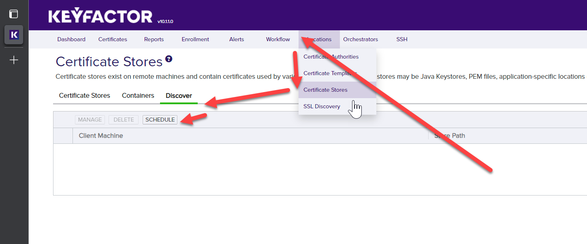
   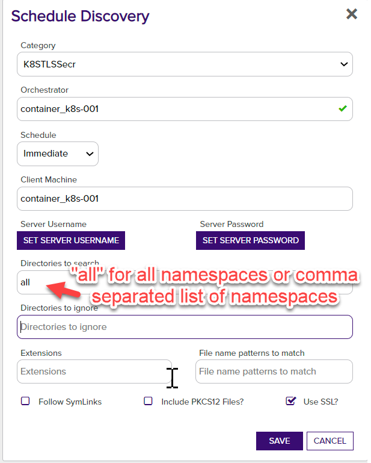
   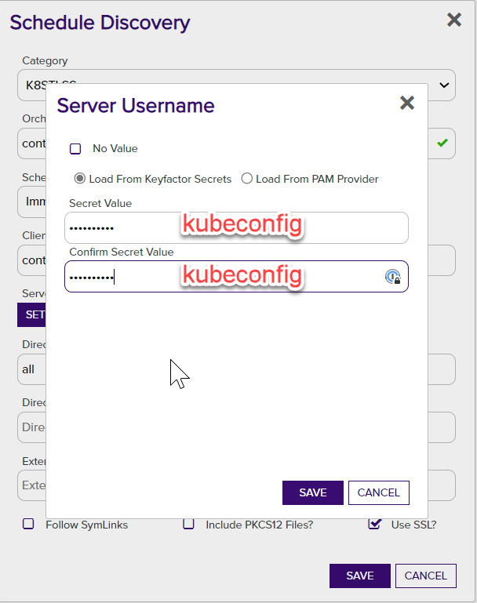
   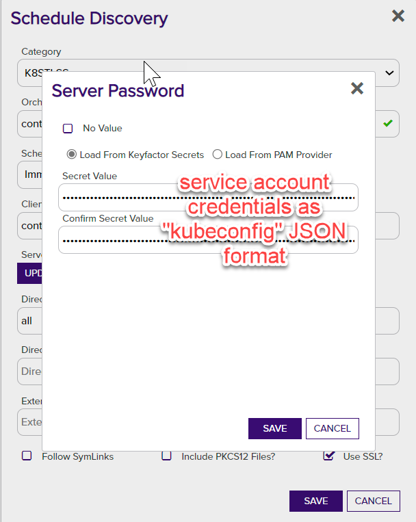
5. Click the "Save" button and wait for the Orchestrator to run the job. This may take some time depending on the number of certificates in the store and the Orchestrator's check-in schedule.

<details><summary>K8SJKS</summary>
### K8SJKS Discovery Job

For discovery of `K8SJKS` stores you can use the following params to filter the certificates that will be discovered:
- `Directories to search` - comma separated list of namespaces to search for certificates OR `all` to search all 
namespaces. *This cannot be left blank.*
- `File name patterns to match` - comma separated list of K8S secret keys to search for PKCS12 or JKS data. Will use 
the following keys by default: `tls.pfx`,`tls.pkcs12`,`pfx`,`pkcs12`,`tls.jks`,`jks`.

</details>
<details><summary>K8SNS</summary>
### K8SNS Discovery Job

For discovery of `K8SNS` stores you can use the following params to filter the certificates that will be discovered:
- `Directories to search` - comma separated list of namespaces to search for certificates OR `all` to search all 
namespaces. *This cannot be left blank.*

</details>
<details><summary>K8SPKCS12</summary>
### K8SPKCS12 Discovery Job

For discovery of `K8SPKCS12` stores you can use the following params to filter the certificates that will be discovered:
- `Directories to search` - comma separated list of namespaces to search for certificates OR `all` to search all
  namespaces. *This cannot be left blank.*
- `File name patterns to match` - comma separated list of K8S secret keys to search for PKCS12 data. Will use
  the following keys by default: `tls.pfx`,`tls.pkcs12`,`pfx`,`pkcs12`,`tls.p12`,`p12`.

</details>
<details><summary>K8SSecret</summary>
### K8SSecret Discovery Job

For discovery of `K8SSecret` stores you can use the following params to filter the certificates that will be discovered:
- `Directories to search` - comma separated list of namespaces to search for certificates OR `all` to search all
  namespaces. *This cannot be left blank.*

</details>
<details><summary>K8STLSSecr</summary>
### K8STLSSecr Discovery Job

For discovery of `K8STLSSecr` stores you can use the following params to filter the certificates that will be discovered:
- `Directories to search` - comma separated list of namespaces to search for certificates OR `all` to search all
  namespaces. *This cannot be left blank.*

</details>
The Kubernetes Orchestrator allows for the remote management of certificate stores defined in a Kubernetes cluster.
The following types of Kubernetes resources are supported: Kubernetes secrets of type `kubernetes.io/tls` or `Opaque`, and
Kubernetes certificates of type `certificates.k8s.io/v1`.

The certificate store types that can be managed in the current version are:
- `K8SCert` - Kubernetes certificates of type `certificates.k8s.io/v1`
- `K8SSecret` - Kubernetes secrets of type `Opaque`
- `K8STLSSecr` - Kubernetes secrets of type `kubernetes.io/tls`
- `K8SCluster` - This allows for a single store to manage a Kubernetes cluster's secrets of type `Opaque` and `kubernetes.io/tls`.
  This can be thought of as a container of `K8SSecret` and `K8STLSSecr` stores across all Kubernetes namespaces.
- `K8SNS` - This allows for a single store to manage a Kubernetes namespace's secrets of type `Opaque` and `kubernetes.io/tls`.
  This can be thought of as a container of `K8SSecret` and `K8STLSSecr` stores for a single Kubernetes namespace.
- `K8SJKS` - Kubernetes secrets of type `Opaque` that contain one or more Java Keystore(s). These cannot be managed at the
  cluster or namespace level as they should all require unique credentials.
- `K8SPKCS12` - Kubernetes secrets of type `Opaque` that contain one or more PKCS12(s). These cannot be managed at the
  cluster or namespace level as they should all require unique credentials.

This orchestrator extension makes use of the Kubernetes API by using a service account
to communicate remotely with certificate stores. The service account must have the correct permissions
in order to perform the desired operations.  For more information on the required permissions, see the
[service account setup guide](#service-account-setup).

## Supported Key Types

The Kubernetes Orchestrator Extension supports certificates with the following key algorithms across all store types:

| Key Type | Sizes/Curves | Supported |
|----------|--------------|-----------|
| RSA | 1024, 2048, 4096, 8192 bit | Yes |
| ECDSA | P-256 (secp256r1), P-384 (secp384r1), P-521 (secp521r1) | Yes |
| DSA | 1024, 2048 bit | Yes |
| Ed25519 | - | Yes |
| Ed448 | - | Yes |

**Note:** DSA 2048-bit keys use FIPS 186-3/4 compliant generation with SHA-256. Edwards curve keys (Ed25519/Ed448) are fully supported for all store types including JKS and PKCS12.

### Kubernetes API Access

This orchestrator extension communicates with the Kubernetes API using credentials supplied as a `kubeconfig` JSON
object. Two authentication methods are supported — choose either based on your environment and security requirements.

The kubeconfig can be provided to the extension in one of two ways:
- As a raw JSON file that contains the credentials
- As a base64 encoded string that contains the credentials

In both cases set **Server Username** to `kubeconfig` and **Server Password** to the kubeconfig content.

#### Option 1: Service Account Token

A long-lived bearer token stored in a `kubernetes.io/service-account-token` Kubernetes Secret.
Simple to set up; the token does not expire unless manually rotated.

> **Note:** Since Kubernetes v1.22, service accounts no longer receive a token Secret automatically.
> The setup script and YAML provided below create the Secret explicitly — do not skip this step.

#### Option 2: Client Certificate

An X.509 client certificate and private key signed by the cluster CA. The certificate CN is used as the
Kubernetes user identity for RBAC — no ServiceAccount object is required. Certificates carry a defined
expiry (typically 1 year, set by cluster CA policy) and can be renewed through Keyfactor.

#### Option 3: In-Cluster / Pod Identity

When the Universal Orchestrator runs as a pod inside the cluster it is managing, it can authenticate using
the **projected service account token** that kubelet mounts automatically. The token is rotated every hour
with no intervention required, and no credentials are stored in Keyfactor Command for that cluster.
Leave **Server Password blank** in Command for stores in the UO's own cluster.

> **Scope:** This option only covers the cluster the UO pod runs in. Additional clusters are still
> configured via a kubeconfig (Options 1 or 2) in the Server Password field.

#### Setup

For full setup instructions, scripts, example kubeconfig files, and the UO deployment manifest for all
three authentication methods, see the [service account setup guide](./scripts/kubernetes/README.md).

## Terraform Modules

Reusable Terraform modules are available for all store types using the [Keyfactor Terraform Provider](https://registry.terraform.io/providers/keyfactor-pub/keyfactor/latest). See the [terraform/](./terraform/) directory for modules, examples, and documentation.

**NOTE:** To use discovery jobs, you must have the store type created in Keyfactor Command and the `needs_server` 
checkbox *MUST* be checked, if you do not select `needs_server` you will not be able to provide credentials to the 
discovery job and it will fail.

The Kubernetes Orchestrator Extension supports certificate discovery jobs.  This allows you to populate the certificate stores with existing certificates.  To run a discovery job, follow these steps:
1. Click on the "Locations > Certificate Stores" menu item.
2. Click the "Discover" tab.
3. Click the "Schedule" button.
4. Configure the job based on storetype. **Note** the "Server Username" field must be set to `kubeconfig` and the "Server Password" field is the `kubeconfig` formatted JSON file containing the service account credentials.  See the "Service Account Setup" section earlier in this README for more information on setting up a service account.
   
   
   
   
5. Click the "Save" button and wait for the Orchestrator to run the job. This may take some time depending on the number of certificates in the store and the Orchestrator's check-in schedule.

## License

Apache License 2.0, see [LICENSE](LICENSE).

## Related Integrations

See all [Keyfactor Universal Orchestrator extensions](https://github.com/orgs/Keyfactor/repositories?q=orchestrator).
