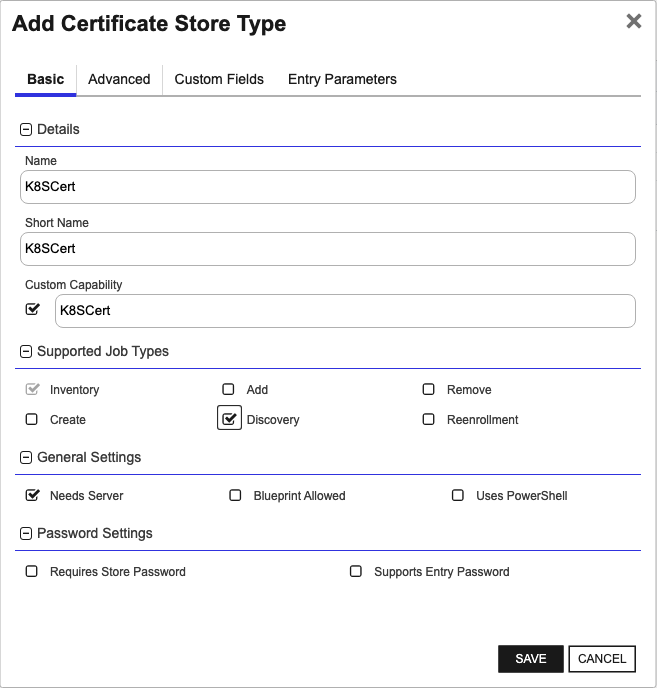
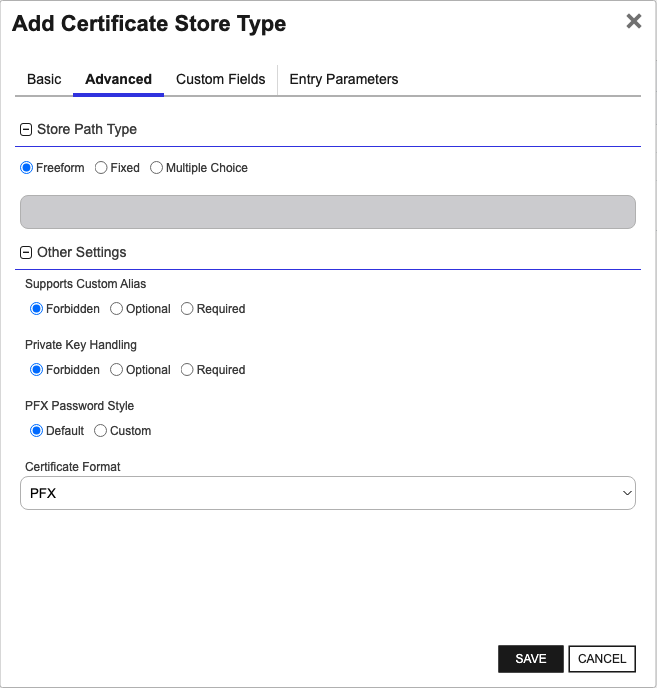
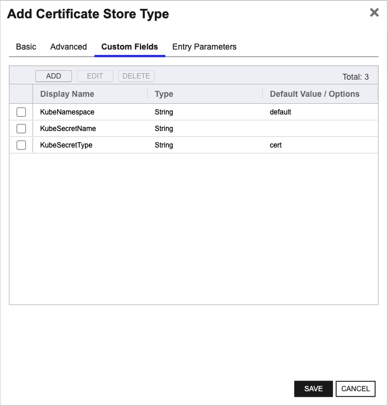

## K8SCert

The K8SCert Certificate Store Type is designed to manage Kubernetes certificates of type `certificates.k8s.io/v1`. This store type interacts with Kubernetes' native CertificateSigningRequest (CSR) resources and manages the lifecycle of Kubernetes certificates, ensuring they are deployed and updated as needed within the cluster.

### Representation

K8SCert represents the certificates requested and issued via Kubernetes' CSR API. These certificates are often employed for various internal Kubernetes operations, such as securing API calls and container-to-container communications within the cluster. By managing these certificates, the orchestrator ensures that communication between different Kubernetes components remains secure.

### Usage and SDK

The K8SCert Certificate Store Type does not require any additional SDKs as it communicates directly with the Kubernetes API using a service account. This integration leverages Kubernetes’ native capabilities to handle certificate requests and issuances, making use of the service account's permissions to perform necessary operations.

### Caveats and Limitations

There are a few important considerations when using the K8SCert Certificate Store Type:

- **Service Account Permissions**: The service account used by the orchestrator must have the necessary permissions to create, view, update, and delete CSRs within the cluster. Insufficient permissions will result in failures to manage certificates properly.
- **Chain of Trust**: Be aware of the chain of trust for certificates managed by the K8SCert store type. Properly configuring and maintaining the trust chain is critical to maintain secure communications.
- **Private Key Handling**: This store type doesn't handle private keys directly within Kubernetes secrets but rather relies on the managed CSR’s mechanisms to secure keys.

The K8SCert Certificate Store Type offers a robust approach to managing Kubernetes-native certificates, ensuring secure and authenticated communication within your Kubernetes environment.


### Supported Job Types

| Job Name | Supported |
| -------- | --------- |
| Inventory | ✅ |
| Management Add |  |
| Management Remove |  |
| Discovery | ✅ |
| Create |  |
| Reenrollment |  |

## Requirements

### Security Considerations
For the Kubernetes Orchestrator Extension to be able to communicate with a Kubernetes cluster, it must
be able to authenticate with the cluster.  This is done by providing the extension with a service account
token that has the appropriate permissions to perform the desired operations. The service account token
can be provided to the extension in one of two ways:
- As a raw JSON file that contains the service account credentials
- As a base64 encoded string that contains the service account credentials

#### Service Account Setup
To set up a service account user on your Kubernetes cluster to be used by the Kubernetes Orchestrator Extension, use the following example as a guide:
```yaml
apiVersion: v1
kind: ServiceAccount
metadata:
  name: keyfactor
  namespace: keyfactor
---
apiVersion: rbac.authorization.k8s.io/v1
kind: ClusterRole
metadata:
  name: keyfactor
rules:
- apiGroups: ["certificates.k8s.io"]
  resources: ["certificatesigningrequests"]
  verbs: ["create", "get", "list", "watch", "update", "patch", "delete"]
- apiGroups: [""]
  resources: ["secrets"]
  verbs: ["create", "get", "list", "watch", "update", "patch", "delete"]
- apiGroups: [""]
  resources: ["namespaces"]
  verbs: ["get", "list", "watch"]
---
apiVersion: rbac.authorization.k8s.io/v1
kind: ClusterRoleBinding
metadata:
  name: keyfactor
roleRef:
    apiGroup: rbac.authorization.k8s.io
    kind: ClusterRole
    name: keyfactor
subjects:
- kind: ServiceAccount
  name: keyfactor
  namespace: keyfactor
```

### Service Account Setup
To set up a service account user on your Kubernetes cluster to be used by the Kubernetes Orchestrator Extension, use the following example as a guide:
```yaml
apiVersion: v1
kind: ServiceAccount
metadata:
  name: keyfactor
  namespace: keyfactor
---
apiVersion: rbac.authorization.k8s.io/v1
kind: ClusterRole
metadata:
  name: keyfactor
rules:
- apiGroups: ["certificates.k8s.io"]
  resources: ["certificatesigningrequests"]
  verbs: ["create", "get", "list", "watch", "update", "patch", "delete"]
- apiGroups: [""]
  resources: ["secrets"]
  verbs: ["create", "get", "list", "watch", "update", "patch", "delete"]
- apiGroups: [""]
  resources: ["namespaces"]
  verbs: ["get", "list", "watch"]
---
apiVersion: rbac.authorization.k8s.io/v1
kind: ClusterRoleBinding
metadata:
  name: keyfactor
roleRef:
    apiGroup: rbac.authorization.k8s.io
    kind: ClusterRole
    name: keyfactor
subjects:
- kind: ServiceAccount
  name: keyfactor
  namespace: keyfactor
```


## Certificate Store Type Configuration

The recommended method for creating the `K8SCert` Certificate Store Type is to use [kfutil](https://github.com/Keyfactor/kfutil). After installing, use the following command to create the `` Certificate Store Type:

```shell
kfutil store-types create K8SCert
```

<details><summary>K8SCert</summary>

Create a store type called `K8SCert` with the attributes in the tables below:

### Basic Tab
| Attribute | Value | Description |
| --------- | ----- | ----- |
| Name | K8SCert | Display name for the store type (may be customized) |
| Short Name | K8SCert | Short display name for the store type |
| Capability | K8SCert | Store type name orchestrator will register with. Check the box to allow entry of value |
| Supported Job Types (check the box for each) | Add, Discovery, Remove | Job types the extension supports |
| Supports Add |  |  Indicates that the Store Type supports Management Add |
| Supports Remove |  |  Indicates that the Store Type supports Management Remove |
| Supports Discovery | ✅ | Check the box. Indicates that the Store Type supports Discovery |
| Supports Reenrollment |  |  Indicates that the Store Type supports Reenrollment |
| Supports Create |  |  Indicates that the Store Type supports store creation |
| Needs Server | ✅ | Determines if a target server name is required when creating store |
| Blueprint Allowed |  | Determines if store type may be included in an Orchestrator blueprint |
| Uses PowerShell |  | Determines if underlying implementation is PowerShell |
| Requires Store Password |  | Determines if a store password is required when configuring an individual store. |
| Supports Entry Password |  | Determines if an individual entry within a store can have a password. |

The Basic tab should look like this:



### Advanced Tab
| Attribute | Value | Description |
| --------- | ----- | ----- |
| Supports Custom Alias | Forbidden | Determines if an individual entry within a store can have a custom Alias. |
| Private Key Handling | Forbidden | This determines if Keyfactor can send the private key associated with a certificate to the store. Required because IIS certificates without private keys would be invalid. |
| PFX Password Style | Default | 'Default' - PFX password is randomly generated, 'Custom' - PFX password may be specified when the enrollment job is created (Requires the Allow Custom Password application setting to be enabled.) |

The Advanced tab should look like this:



### Custom Fields Tab
Custom fields operate at the certificate store level and are used to control how the orchestrator connects to the remote target server containing the certificate store to be managed. The following custom fields should be added to the store type:

| Name | Display Name | Type | Default Value/Options | Required | Description |
| ---- | ------------ | ---- | --------------------- | -------- | ----------- |


The Custom Fields tab should look like this:




</details>

## Certificate Store Configuration

After creating the `K8SCert` Certificate Store Type and installing the Kubernetes Universal Orchestrator extension, you can create new [Certificate Stores](https://software.keyfactor.com/Core-OnPrem/Current/Content/ReferenceGuide/Certificate%20Stores.htm?Highlight=certificate%20store) to manage certificates in the remote platform.

The following table describes the required and optional fields for the `K8SCert` certificate store type.

| Attribute | Description | Attribute is PAM Eligible |
| --------- | ----------- | ------------------------- |
| Category | Select "K8SCert" or the customized certificate store name from the previous step. | |
| Container | Optional container to associate certificate store with. | |
| Client Machine | The `Client Machine` field should contain the IP address or hostname of the Kubernetes cluster's API server. For example, 'https://k8s.cluster.local:6443'. | |
| Store Path | The `Store Path` field should contain the namespace and name of the Kubernetes certificate resource in the format 'namespace/secretName'. For example, 'default/my-cert'. | |
| Orchestrator | Select an approved orchestrator capable of managing `K8SCert` certificates. Specifically, one with the `K8SCert` capability. | |

* **Using kfutil**

    ```shell
    # Generate a CSV template for the AzureApp certificate store
    kfutil stores import generate-template --store-type-name K8SCert --outpath K8SCert.csv

    # Open the CSV file and fill in the required fields for each certificate store.

    # Import the CSV file to create the certificate stores
    kfutil stores import csv --store-type-name K8SCert --file K8SCert.csv
    ```

* **Manually with the Command UI**: In Keyfactor Command, navigate to Certificate Stores from the Locations Menu. Click the Add button to create a new Certificate Store using the attributes in the table above.