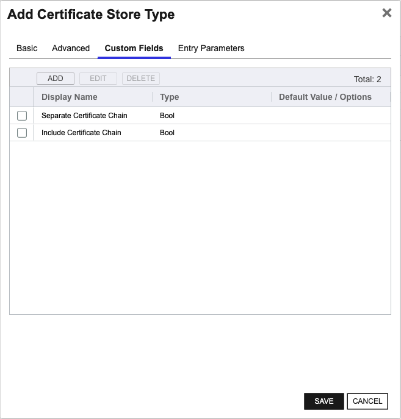

## K8SCluster

The K8SCluster Certificate Store Type enables the management of certificates across an entire Kubernetes cluster. This store type is designed to handle Kubernetes secrets of type `Opaque` and `kubernetes.io/tls` across all namespaces within a cluster, acting as a container for `K8SSecret` and `K8STLSSecret` stores.

### Representation

K8SCluster represents a higher-level aggregation of secrets management, providing a unified interface to manage certificates across multiple namespaces. This is particularly useful for organizations wanting centralized control over their certificate infrastructure within a Kubernetes environment.

### Usage and SDK

The K8SCluster Certificate Store Type does not require any additional SDKs as it relies on Kubernetes’ native API capabilities. The orchestrator uses a service account to interact with the Kubernetes API, performing operations needed to inventory and manage secrets across the cluster.

### Caveats and Limitations

There are some important considerations when using the K8SCluster Certificate Store Type:

- **Service Account Permissions**: The service account should have sufficient permissions to list, create, update, and delete secrets across all namespaces. The lack of such permissions can hinder the orchestrator's ability to manage certificates.
- **Resource Scope**: Managing certificates at the cluster level can be complex due to the varied configurations and security policies across different namespaces. It's important to ensure that sensitive data is properly segregated and managed according to security best practices.
- **Configuration Complexity**: Given the broad scope of management, initial configuration can be intricate. Proper attention to detail is required to ensure all namespaces and their resources are correctly configured for certificate management.

The K8SCluster Certificate Store Type offers a comprehensive solution for managing certificates across a Kubernetes cluster, providing centralized control while ensuring secure and efficient certificate lifecycle management.


### Supported Job Types

| Job Name | Supported |
| -------- | --------- |
| Inventory | ✅ |
| Management Add | ✅ |
| Management Remove | ✅ |
| Discovery |  |
| Create | ✅ |
| Reenrollment |  |

## Requirements

### Security Considerations
For the Kubernetes Orchestrator Extension to be able to communicate with a Kubernetes cluster, it must
be able to authenticate with the cluster.  This is done by providing the extension with a service account
token that has the appropriate permissions to perform the desired operations. The service account token
can be provided to the extension in one of two ways:
- As a raw JSON file that contains the service account credentials
- As a base64 encoded string that contains the service account credentials

### Service Account Setup
To set up a service account user on your Kubernetes cluster to be used by the Kubernetes Orchestrator Extension, use the following example as a guide:
```yaml
apiVersion: v1
kind: ServiceAccount
metadata:
  name: keyfactor
  namespace: keyfactor
---
apiVersion: rbac.authorization.k8s.io/v1
kind: ClusterRole
metadata:
  name: keyfactor
rules:
- apiGroups: ["certificates.k8s.io"]
  resources: ["certificatesigningrequests"]
  verbs: ["create", "get", "list", "watch", "update", "patch", "delete"]
- apiGroups: [""]
  resources: ["secrets"]
  verbs: ["create", "get", "list", "watch", "update", "patch", "delete"]
- apiGroups: [""]
  resources: ["namespaces"]
  verbs: ["get", "list", "watch"]
---
apiVersion: rbac.authorization.k8s.io/v1
kind: ClusterRoleBinding
metadata:
  name: keyfactor
roleRef:
    apiGroup: rbac.authorization.k8s.io
    kind: ClusterRole
    name: keyfactor
subjects:
- kind: ServiceAccount
  name: keyfactor
  namespace: keyfactor
```

### Service Account Setup
To set up a service account user on your Kubernetes cluster to be used by the Kubernetes Orchestrator Extension, use the following example as a guide:
```yaml
apiVersion: v1
kind: ServiceAccount
metadata:
  name: keyfactor
  namespace: keyfactor
---
apiVersion: rbac.authorization.k8s.io/v1
kind: ClusterRole
metadata:
  name: keyfactor
rules:
- apiGroups: ["certificates.k8s.io"]
  resources: ["certificatesigningrequests"]
  verbs: ["create", "get", "list", "watch", "update", "patch", "delete"]
- apiGroups: [""]
  resources: ["secrets"]
  verbs: ["create", "get", "list", "watch", "update", "patch", "delete"]
- apiGroups: [""]
  resources: ["namespaces"]
  verbs: ["get", "list", "watch"]
---
apiVersion: rbac.authorization.k8s.io/v1
kind: ClusterRoleBinding
metadata:
  name: keyfactor
roleRef:
    apiGroup: rbac.authorization.k8s.io
    kind: ClusterRole
    name: keyfactor
subjects:
- kind: ServiceAccount
  name: keyfactor
  namespace: keyfactor
```


## Certificate Store Type Configuration

The recommended method for creating the `K8SCluster` Certificate Store Type is to use [kfutil](https://github.com/Keyfactor/kfutil). After installing, use the following command to create the `` Certificate Store Type:

```shell
kfutil store-types create K8SCluster
```

<details><summary>K8SCluster</summary>

Create a store type called `K8SCluster` with the attributes in the tables below:

### Basic Tab
| Attribute | Value | Description |
| --------- | ----- | ----- |
| Name | K8SCluster | Display name for the store type (may be customized) |
| Short Name | K8SCluster | Short display name for the store type |
| Capability | K8SCluster | Store type name orchestrator will register with. Check the box to allow entry of value |
| Supported Job Types (check the box for each) | Add, Discovery, Remove | Job types the extension supports |
| Supports Add | ✅ | Check the box. Indicates that the Store Type supports Management Add |
| Supports Remove | ✅ | Check the box. Indicates that the Store Type supports Management Remove |
| Supports Discovery |  |  Indicates that the Store Type supports Discovery |
| Supports Reenrollment |  |  Indicates that the Store Type supports Reenrollment |
| Supports Create | ✅ | Check the box. Indicates that the Store Type supports store creation |
| Needs Server | ✅ | Determines if a target server name is required when creating store |
| Blueprint Allowed |  | Determines if store type may be included in an Orchestrator blueprint |
| Uses PowerShell |  | Determines if underlying implementation is PowerShell |
| Requires Store Password |  | Determines if a store password is required when configuring an individual store. |
| Supports Entry Password |  | Determines if an individual entry within a store can have a password. |

The Basic tab should look like this:


### Advanced Tab
| Attribute | Value | Description |
| --------- | ----- | ----- |
| Supports Custom Alias | Required | Determines if an individual entry within a store can have a custom Alias. |
| Private Key Handling | Optional | This determines if Keyfactor can send the private key associated with a certificate to the store. Required because IIS certificates without private keys would be invalid. |
| PFX Password Style | Default | 'Default' - PFX password is randomly generated, 'Custom' - PFX password may be specified when the enrollment job is created (Requires the Allow Custom Password application setting to be enabled.) |

The Advanced tab should look like this:


### Custom Fields Tab
Custom fields operate at the certificate store level and are used to control how the orchestrator connects to the remote target server containing the certificate store to be managed. The following custom fields should be added to the store type:

| Name | Display Name | Type | Default Value/Options | Required | Description |
| ---- | ------------ | ---- | --------------------- | -------- | ----------- |


The Custom Fields tab should look like this:




</details>

## Certificate Store Configuration

After creating the `K8SCluster` Certificate Store Type and installing the Kubernetes Universal Orchestrator extension, you can create new [Certificate Stores](https://software.keyfactor.com/Core-OnPrem/Current/Content/ReferenceGuide/Certificate%20Stores.htm?Highlight=certificate%20store) to manage certificates in the remote platform.

The following table describes the required and optional fields for the `K8SCluster` certificate store type.

| Attribute | Description | Attribute is PAM Eligible |
| --------- | ----------- | ------------------------- |
| Category | Select "K8SCluster" or the customized certificate store name from the previous step. | |
| Container | Optional container to associate certificate store with. | |
| Client Machine | For the Client Machine field when instantiating new Certificate Stores of type 'K8SCluster', enter the Kubernetes cluster endpoint or API server URL. Example: 'https://api.k8s.cluster.local:6443'. | |
| Store Path | For the Store Path field when instantiating new Certificate Stores of type 'K8SCluster', enter the name of the Kubernetes cluster. Example: 'my-k8s-cluster'. | |
| Orchestrator | Select an approved orchestrator capable of managing `K8SCluster` certificates. Specifically, one with the `K8SCluster` capability. | |

* **Using kfutil**

    ```shell
    # Generate a CSV template for the AzureApp certificate store
    kfutil stores import generate-template --store-type-name K8SCluster --outpath K8SCluster.csv

    # Open the CSV file and fill in the required fields for each certificate store.

    # Import the CSV file to create the certificate stores
    kfutil stores import csv --store-type-name K8SCluster --file K8SCluster.csv
    ```

* **Manually with the Command UI**: In Keyfactor Command, navigate to Certificate Stores from the Locations Menu. Click the Add button to create a new Certificate Store using the attributes in the table above.