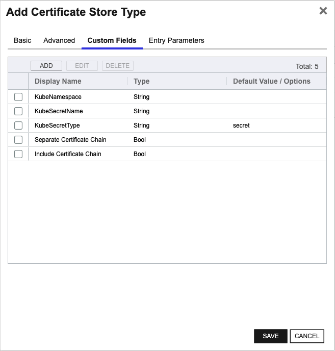

## K8SSecret

The K8SSecret Certificate Store Type is designed to manage Kubernetes secrets of type `Opaque`. This store type provides functionality for storing and managing various certificates and their associated private keys within Kubernetes secrets, allowing for secure and organized certificate management.

### Representation

K8SSecret represents Kubernetes `Opaque` secrets that can contain arbitrary fields. However, the orchestrator specifically manages fields named `certificates` and `private_keys`, ensuring that certificate and key data is handled securely and efficiently. This is useful for various applications and services within a Kubernetes cluster that need to securely store and access certificates.

### Usage and SDK

The K8SSecret Certificate Store Type communicates directly with the Kubernetes API using a service account, eliminating the need for any additional SDKs. The orchestrator leverages the permissions of the service account to perform necessary operations such as inventory, add, and remove certificates within the Kubernetes secrets.

### Caveats and Limitations

Several important considerations should be noted when using the K8SSecret Certificate Store Type:

- **Service Account Permissions**: The service account must have the appropriate permissions to create, list, update, and delete secrets within the specified Kubernetes namespace. Without sufficient permissions, the orchestrator will not be able to manage the secrets effectively.

- **Field Constraints**: The orchestrator will only manage the fields named `certificates` and `private_keys` within the secret. Any other fields will be ignored, which means users must ensure that the relevant data is stored in these fields.

- **Single Certificate Management**: This store type supports the management of a single certificate within each secret. Adding a new certificate will overwrite the existing fields in the secret. Users should be cautious of this behavior to avoid unintentional data loss.

By considering these factors, the K8SSecret Certificate Store Type offers a reliable way to manage `Opaque` secrets in Kubernetes, ensuring secure and efficient certificate lifecycle management within the cluster.


### Supported Job Types

| Job Name | Supported |
| -------- | --------- |
| Inventory | ✅ |
| Management Add | ✅ |
| Management Remove | ✅ |
| Discovery | ✅ |
| Create | ✅ |
| Reenrollment |  |

## Requirements

### Security Considerations
For the Kubernetes Orchestrator Extension to be able to communicate with a Kubernetes cluster, it must
be able to authenticate with the cluster.  This is done by providing the extension with a service account
token that has the appropriate permissions to perform the desired operations. The service account token
can be provided to the extension in one of two ways:
- As a raw JSON file that contains the service account credentials
- As a base64 encoded string that contains the service account credentials

### Service Account Setup
To set up a service account user on your Kubernetes cluster to be used by the Kubernetes Orchestrator Extension, use the following example as a guide:
```yaml
apiVersion: v1
kind: ServiceAccount
metadata:
  name: keyfactor
  namespace: keyfactor
---
apiVersion: rbac.authorization.k8s.io/v1
kind: ClusterRole
metadata:
  name: keyfactor
rules:
- apiGroups: ["certificates.k8s.io"]
  resources: ["certificatesigningrequests"]
  verbs: ["create", "get", "list", "watch", "update", "patch", "delete"]
- apiGroups: [""]
  resources: ["secrets"]
  verbs: ["create", "get", "list", "watch", "update", "patch", "delete"]
- apiGroups: [""]
  resources: ["namespaces"]
  verbs: ["get", "list", "watch"]
---
apiVersion: rbac.authorization.k8s.io/v1
kind: ClusterRoleBinding
metadata:
  name: keyfactor
roleRef:
    apiGroup: rbac.authorization.k8s.io
    kind: ClusterRole
    name: keyfactor
subjects:
- kind: ServiceAccount
  name: keyfactor
  namespace: keyfactor
```

### Service Account Setup
To set up a service account user on your Kubernetes cluster to be used by the Kubernetes Orchestrator Extension, use the following example as a guide:
```yaml
apiVersion: v1
kind: ServiceAccount
metadata:
  name: keyfactor
  namespace: keyfactor
---
apiVersion: rbac.authorization.k8s.io/v1
kind: ClusterRole
metadata:
  name: keyfactor
rules:
- apiGroups: ["certificates.k8s.io"]
  resources: ["certificatesigningrequests"]
  verbs: ["create", "get", "list", "watch", "update", "patch", "delete"]
- apiGroups: [""]
  resources: ["secrets"]
  verbs: ["create", "get", "list", "watch", "update", "patch", "delete"]
- apiGroups: [""]
  resources: ["namespaces"]
  verbs: ["get", "list", "watch"]
---
apiVersion: rbac.authorization.k8s.io/v1
kind: ClusterRoleBinding
metadata:
  name: keyfactor
roleRef:
    apiGroup: rbac.authorization.k8s.io
    kind: ClusterRole
    name: keyfactor
subjects:
- kind: ServiceAccount
  name: keyfactor
  namespace: keyfactor
```


## Certificate Store Type Configuration

The recommended method for creating the `K8SSecret` Certificate Store Type is to use [kfutil](https://github.com/Keyfactor/kfutil). After installing, use the following command to create the `` Certificate Store Type:

```shell
kfutil store-types create K8SSecret
```

<details><summary>K8SSecret</summary>

Create a store type called `K8SSecret` with the attributes in the tables below:

### Basic Tab
| Attribute | Value | Description |
| --------- | ----- | ----- |
| Name | K8SSecret | Display name for the store type (may be customized) |
| Short Name | K8SSecret | Short display name for the store type |
| Capability | K8SSecret | Store type name orchestrator will register with. Check the box to allow entry of value |
| Supported Job Types (check the box for each) | Add, Discovery, Remove | Job types the extension supports |
| Supports Add | ✅ | Check the box. Indicates that the Store Type supports Management Add |
| Supports Remove | ✅ | Check the box. Indicates that the Store Type supports Management Remove |
| Supports Discovery | ✅ | Check the box. Indicates that the Store Type supports Discovery |
| Supports Reenrollment |  |  Indicates that the Store Type supports Reenrollment |
| Supports Create | ✅ | Check the box. Indicates that the Store Type supports store creation |
| Needs Server | ✅ | Determines if a target server name is required when creating store |
| Blueprint Allowed |  | Determines if store type may be included in an Orchestrator blueprint |
| Uses PowerShell |  | Determines if underlying implementation is PowerShell |
| Requires Store Password |  | Determines if a store password is required when configuring an individual store. |
| Supports Entry Password |  | Determines if an individual entry within a store can have a password. |

The Basic tab should look like this:


### Advanced Tab
| Attribute | Value | Description |
| --------- | ----- | ----- |
| Supports Custom Alias | Forbidden | Determines if an individual entry within a store can have a custom Alias. |
| Private Key Handling | Optional | This determines if Keyfactor can send the private key associated with a certificate to the store. Required because IIS certificates without private keys would be invalid. |
| PFX Password Style | Default | 'Default' - PFX password is randomly generated, 'Custom' - PFX password may be specified when the enrollment job is created (Requires the Allow Custom Password application setting to be enabled.) |

The Advanced tab should look like this:


### Custom Fields Tab
Custom fields operate at the certificate store level and are used to control how the orchestrator connects to the remote target server containing the certificate store to be managed. The following custom fields should be added to the store type:

| Name | Display Name | Type | Default Value/Options | Required | Description |
| ---- | ------------ | ---- | --------------------- | -------- | ----------- |


The Custom Fields tab should look like this:




</details>

## Certificate Store Configuration

After creating the `K8SSecret` Certificate Store Type and installing the Kubernetes Universal Orchestrator extension, you can create new [Certificate Stores](https://software.keyfactor.com/Core-OnPrem/Current/Content/ReferenceGuide/Certificate%20Stores.htm?Highlight=certificate%20store) to manage certificates in the remote platform.

The following table describes the required and optional fields for the `K8SSecret` certificate store type.

| Attribute | Description | Attribute is PAM Eligible |
| --------- | ----------- | ------------------------- |
| Category | Select "K8SSecret" or the customized certificate store name from the previous step. | |
| Container | Optional container to associate certificate store with. | |
| Client Machine | For the Client Machine field when instantiating new Certificate Stores of type 'K8SSecret', enter the Kubernetes cluster endpoint or API server URL. Example: 'https://api.k8s.cluster.local:6443'. | |
| Store Path | For the Store Path field when instantiating new Certificate Stores of type 'K8SSecret', enter the namespace and the secret name in the format 'namespace/secretName'. Example: 'default/my-secret'. | |
| Orchestrator | Select an approved orchestrator capable of managing `K8SSecret` certificates. Specifically, one with the `K8SSecret` capability. | |

* **Using kfutil**

    ```shell
    # Generate a CSV template for the AzureApp certificate store
    kfutil stores import generate-template --store-type-name K8SSecret --outpath K8SSecret.csv

    # Open the CSV file and fill in the required fields for each certificate store.

    # Import the CSV file to create the certificate stores
    kfutil stores import csv --store-type-name K8SSecret --file K8SSecret.csv
    ```

* **Manually with the Command UI**: In Keyfactor Command, navigate to Certificate Stores from the Locations Menu. Click the Add button to create a new Certificate Store using the attributes in the table above.